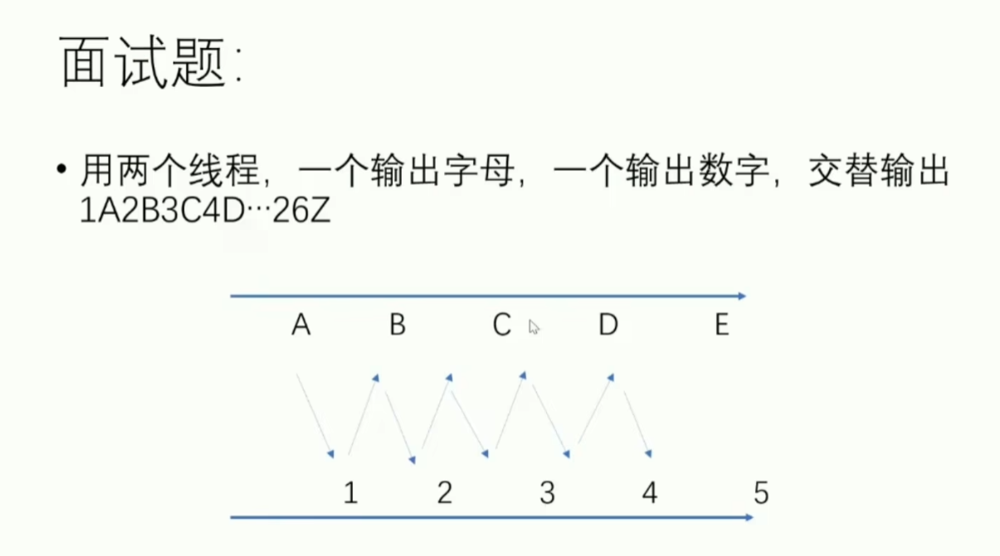
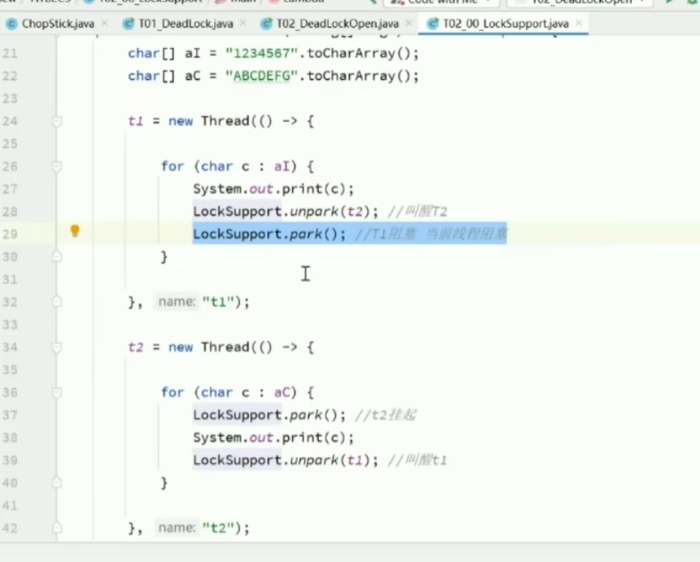
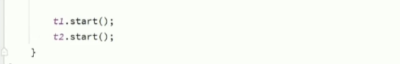
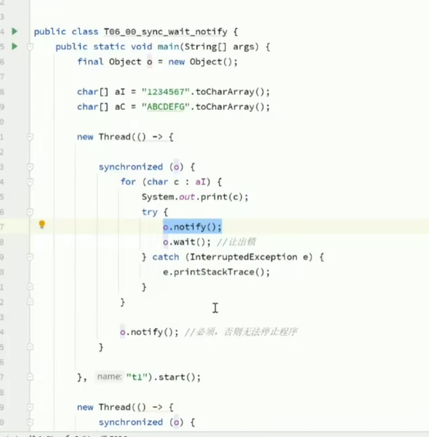
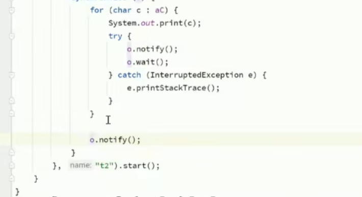
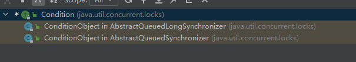

线程不能从时间角度和优先级角度，join的99%不对

一
---

二
---

notify 唤醒线程是控制不指定的线程了

condition是reentrantLock的方法，创建一个condition

reentrantLock 
    可以公平锁（默认非公平）（公平就是先来后到，非公平就是竞争） 
    可以尝试上锁（tryLock） 
    有多个队列condition 
    锁是可打断的 lockInterruptibly()

synchronized    
    非公平锁  
    获取不到锁一直等待 
    有一个队列 
    锁是不可以被打断的

transferQueue take 和transfer
https://blog.csdn.net/inthat/article/details/108360964