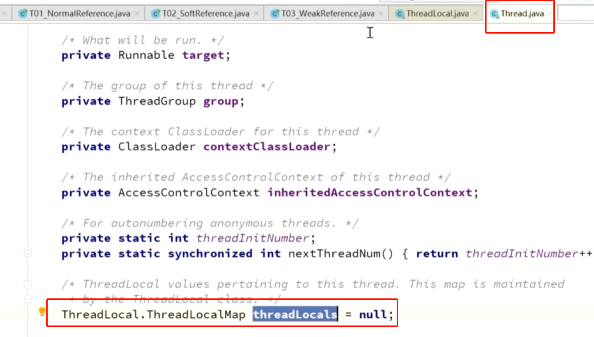
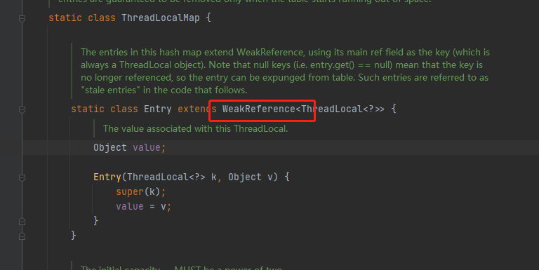
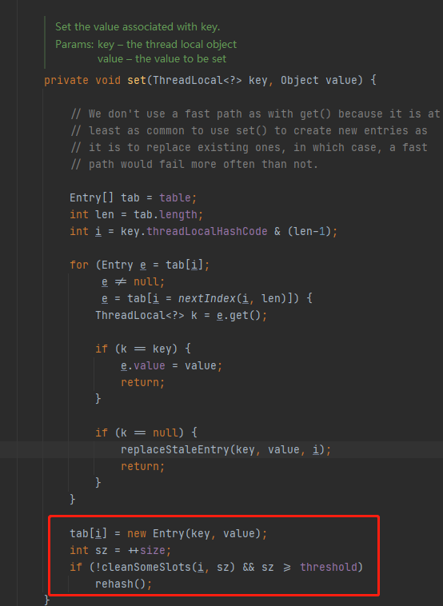

ThreadLocal很容易让人望文生义，想当然地认为是一个“本地线程”。
其实，ThreadLocal并不是一个Thread，而是Thread的局部变量，也许把它命名为ThreadLocalVariable更容易让人理解一些。

在Java的多线程编程中，为保证多个线程对共享变量的安全访问，通常会使用synchronized来保证同一时刻只有一个线程对共享变量进行操作。这种情况下可以将类变量放到ThreadLocal类型的对象中，使变量在每个线程中都有独立拷贝，不会出现一个线程读取变量时而被另一个线程修改的现象。

实现由内部ThreadLocalMap，ThreadLocalMap就是管理线程中多个threadLocal，在thread类中就有ThreadLocalMap这个属性。

Entry 的 key 就是 ThreadLocal 的引用，value 是 ThreadLocal 的值。

threadLocalMap里面是key value  在代码里就是一个个的entry。

而这个entry就继承了weakReference, key就是weakReference也就是弱引用。

为了防止内存泄漏，使用了弱引用（GC一旦触发回收，弱引用对象就回收）

但是map中的value还在，但是没有引用指向这个value，key没了已经。GC时就找不到了，就会造成内存泄漏。

所以必须手动调用remove

threadLocal在@transactional的作用

    在a方法上增加@transactional 如果在a方法内调用了2个SQL的方法 
    为了保证两个SQL的数据库连接是同一个，调用a方法的线程中就使用到了threadLocal
    多线程情况下 每个线程调用的数据库连接不会串。

除了 Spring 事务管理器采用了 ThreadLocal

Spring MVC 的 RequestContextHolder 的实现使用了 ThreadLocal

多线程 保证线程之间的数据独立，很多都采用这个方式.
    