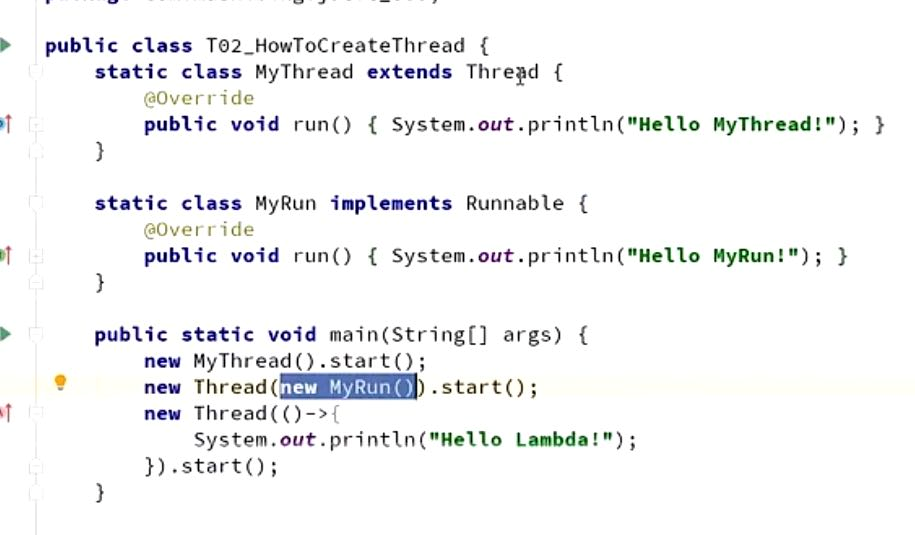
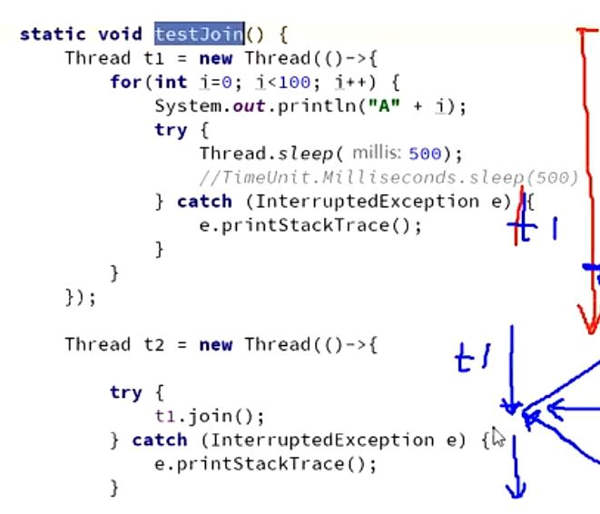
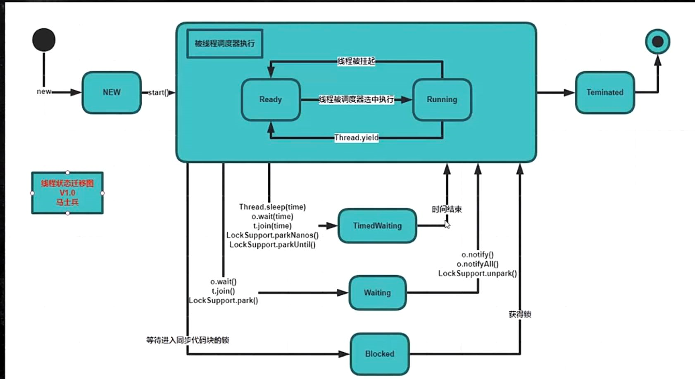

extend thread类 重写run方法

调用run()或者start()方法
run和start区别:
run在主线程执行代码，start启动新线程执行代码

class实现runnable接口 重写run方法
然后new thread(class).start()



lambda表达式 （）->{}


启动线程的三种方法？

    除了上面两种，通过线程池来启动

thread.yield() 是什么？

    RUNNING状态的线程进入 RUNNABLE 的ready
    让一下CPU资源，无法保证其他线程能不能抢到

thread.join()


等t2结束了t1才执行 把两个线程和成一个

t1 t2 t3 如何顺序执行？ 

    在主线程里，依次调用t1.join(),t2.join(),t3.join()
    也可以在t1方法内部调用t2.join(),t2方法内部调用t3.join()

线程有几个状态？ 6个

    new 线程新生
    runnable 运行（ready->running）(running到ready就是调用thread.yield())
    blocked 阻塞
    waiting 等待 一直等
    timed_waiting 超时等待 等待固定时间
    terminated 终止




wait/sleep区别？

    wait->object的方法 ，sleep->thread的方法

    wait释放锁，sleep不释放

    wait必须在同步代码块睡，sleep可以在任何地方睡

notify和notifyAll为什么不释放锁

    notify()或者notifyAll()调用时并不会真正释放对象锁, 必须等到synchronized方法或者语法块执行完才真正释放锁.

thread.join()是什么？(join内部就是wait,notifyAll)
a.join(b) a->b>-a

        /**join的意思是使得放弃当前线程的执行，并返回对应的线程，例如下面代码的意思就是：
         程序在main线程中调用t1线程的join方法，则main线程放弃cpu控制权，并返回t1线程继续执行直到线程t1执行完毕
         所以结果是t1线程执行完后，才到主线程执行，相当于在main线程中同步t1线程，t1执行完了，main线程才有执行的机会
         */

synchronized锁的是什么？
    
    锁this,锁普通方法，锁当前对象实例;

        Java中每个对象都有一个锁或者称为监视器，当访问某个对象的synchronized方法时，表示将该对象上锁，而不仅仅是为该方法上锁。

        这样如果一个对象的synchronized方法被某个线程执行时，其他线程无法访问该对象的任何synchronized方法（但是可以调用其他非synchronized的方法）。

        直至该synchronized方法执行完。

    锁(object)的是object对象; 

        这里的object 可以为类中的一个属性、也可以是当前的对象，它的同步效果和修饰普通方法一样；

    锁静态方法,锁类.锁的是class，如果synchronized（obj.class)也是锁类的class

        当调用一个对象的静态synchronized方法时，它锁定的并不是synchronized方法所在的对象，

        而是synchronized方法所在对象对应的Class对象。

        这样，其他线程就不能调用该类的其他静态synchronized方法了，但是可以调用非静态的synchronized方法。
    

synchronized(object)不要用String常量（string在常量池，多处定义的string变量相等）
不要用基础类型 (基础类型发生变化，已经不是原来的对象了)

为什么synchronized是重入锁？

如果不可重入，子类调用父类的方法，都是synchronized，就会死锁。是否可重入获取锁的时候判断否是当前线程
打开字节码文件,子类方法会指向运行时常量池的父类方法：
```
0 aload_0
1 invokespecial #2 <com/github/qyl/parent.method1 : ()V>
4 return
```


锁和异常:

    方法抛出异常，锁释放; try-catch捕获异常，兜底处理业务代码

偏向锁：
    mark word 记录线程ID
    如果有线程争用，升级自旋锁
    JVM启动时 偏向锁开启是有延迟的
自旋锁：
    线程争用，锁自旋（CAS） do while 超过阈值后升级重量级，默认10次，可自适应自旋

执行时间长 线程多的（阻塞的线程都去等待队列） 适合用系统锁（都是synchronized）
执行时间短（加锁代码） 线程少的 适合用自旋锁（CAS）（因为自旋占CPU）


参考：
---
https://www.csdn.net/tags/MtTacgxsNDIyNzQtYmxvZwO0O0OO0O0O.html