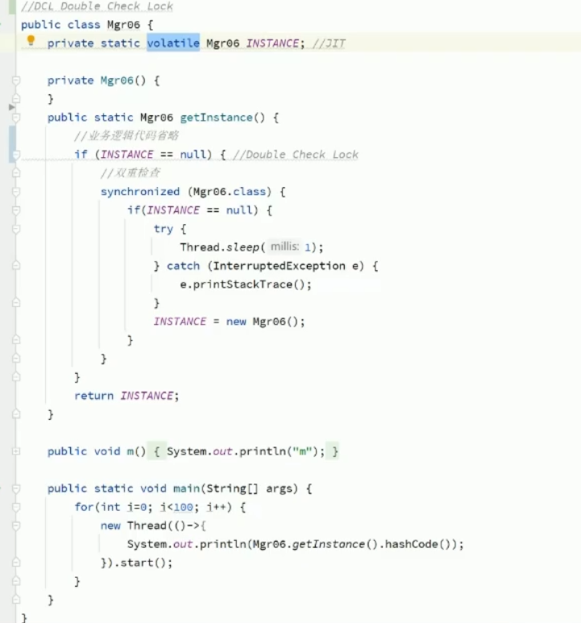

dlc 双重检查

三个保证 可见性 顺序性 原子性

懒汉式单例为例:

在if (instance==null)
在对象不等于null但是类加载器未完成初始化，未赋显式值时。
会会将默认值的对象返回。
比如说int的默认值就是0，它不是null，就会返回。

volatile

A happens-before B，B happens-before C，那么A happens-before C