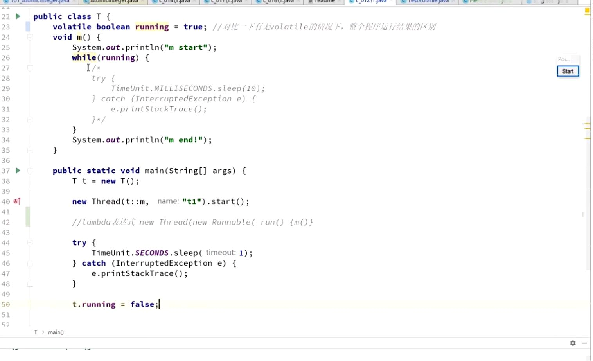
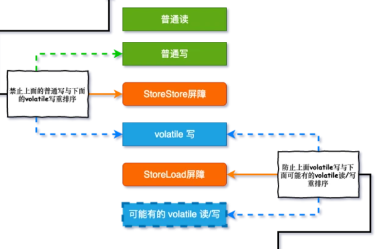
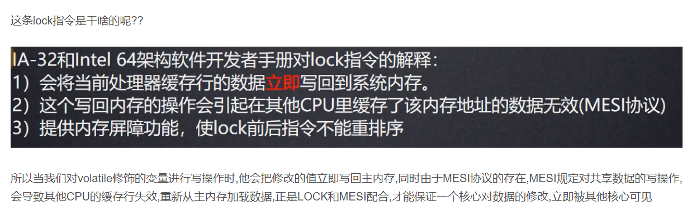
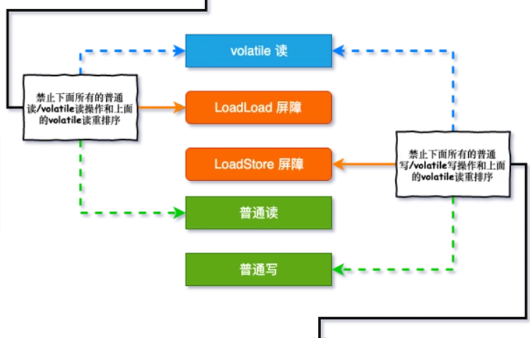

volatile 可变；易变的。

保证线程可见性；
主线程，工作线程同步变量
volatile变量每次读都需要去主内存读取最新的值，每次写也需要写回到主内存。
非volatile变量允许在缓存中读写以加快计算速度。

内存屏障：读屏障 写屏障

volatile写是前后分别加storeStore,storeLoad

Lock汇编指令

volatile读是后面加两个storeLoad

缓存读写一致性

禁止指令重排序；
    -DCL单例
    -double check lock

重排序需要遵循happens-before