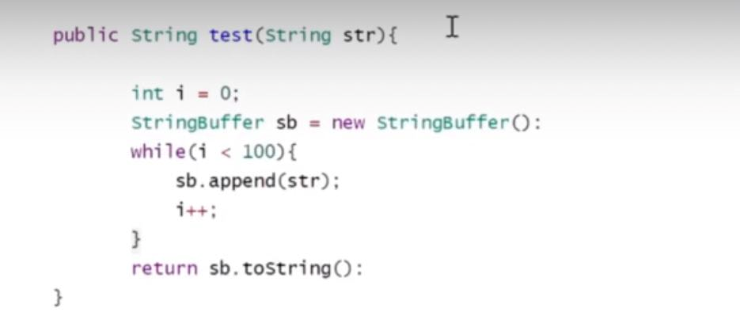

实现原理
---
objectMonitor

每个Java对象内部都有一个监视器锁（monitor）

拿可重入锁举例 ，线程获取锁时将0改为1，如果线程已经占有该锁，加1.

其他线程竞争会进入阻塞状态，直到monitor为0

字节码层级（类加载器加载到内存）:

    monitorEnter 

    monitorExit

执行过程中进行锁升级。

在汇编层级（JIT编译器翻译成机器码）：

    lock comxchg

锁消除 lock eliminate
---

    public void add() {
        StringBuffer sb = new StringBuffer();
        sb.append("aaa").append("bbb");
    }

JDK检测到StringBuffer在方法内，没有被外部其他线程应用，
JVM会自动消除StringBuffer对象内部的锁。

锁粗化 lock coarsening
---

JVM检测到一连串循环都是对同一对象加锁
（while循环内100次 就有100次加锁/解锁）
JVM会将锁的范围粗话的一连串循环外部 比如 while前面。
使得这一串操作只需要加一次锁。

比如在一张数据库上所有行加行锁，不如整个表锁。

使用对象作为锁，属性发生变化，不影响锁使用，但对象被重新赋值，会发生问题。

所以避免对象引用发生变化，如使用final修饰符。

锁细化
---

执行时间短的更适合synchronized，如:

锁升级过程中 Java对象头markWord的变化。

