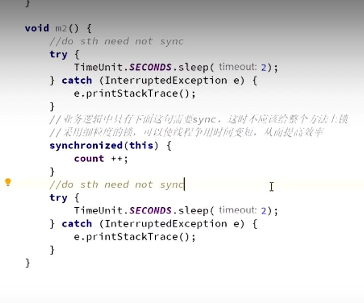

锁消除 lock eliminate
---

    public void add() {
        StringBuffer sb = new StringBuffer();
        sb.append("aaa").append("bbb");
    }

JDK检测到StringBuffer在方法内，没有被外部其他线程应用，
JVM会自动消除StringBuffer对象内部的锁。

锁粗化 lock coarsening
---

比如在一张数据库上所有行加行锁，不如整个表锁。

使用对象作为锁，属性发生变化，不影响锁使用，但对象被重新赋值，会发生问题。

所以避免对象引用发生变化，如使用final修饰符。

锁细化
---

执行时间短的更适合synchronized，如:
