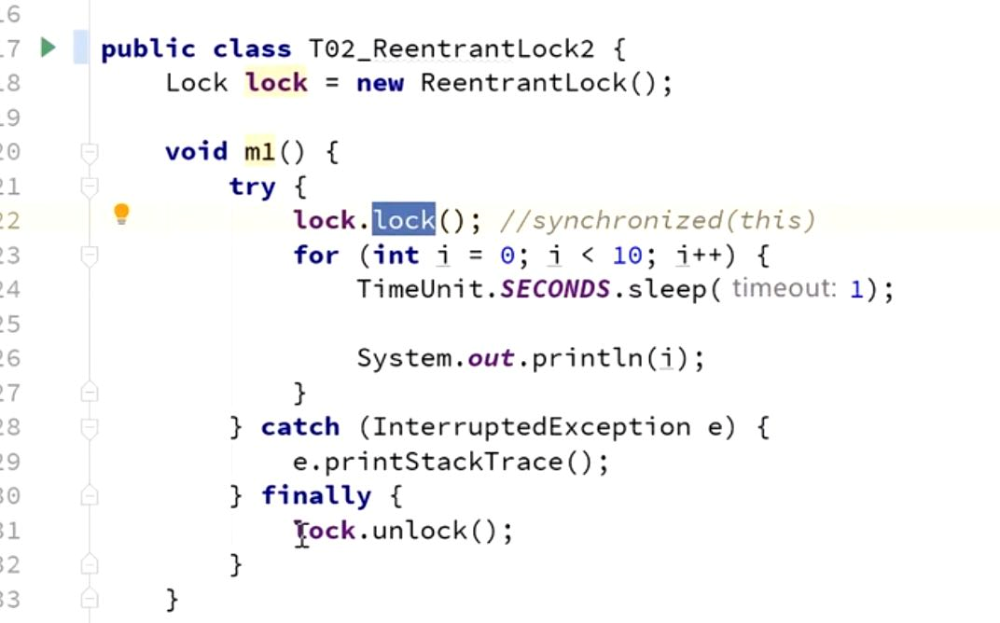
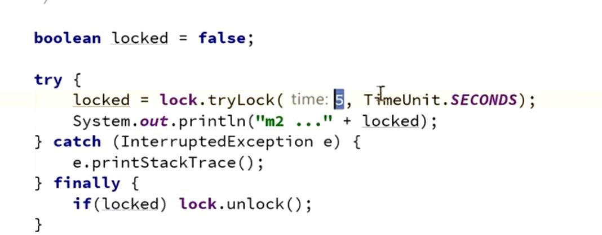
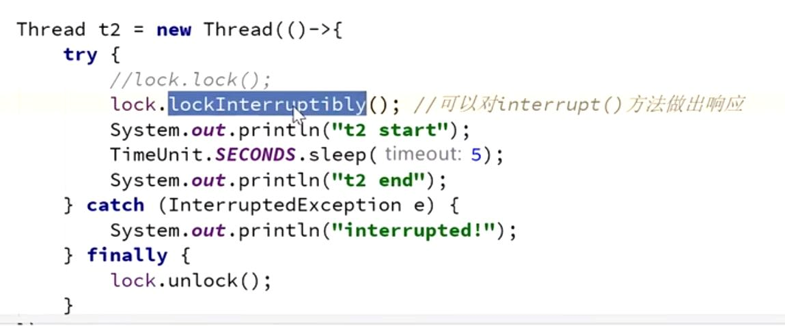

synchronized和reentrantLock一样是可以重入的

手动加锁，手动解锁（try finally)

synchronized获取不到锁会阻塞等待

reentrantLock可以尝试获取锁，并等待一定时间

lock.tryLock(5,TimeUnit.SECONDS) 在5秒内尝试拿锁。

可以打断

    在Thread a 内部  在加锁的时候写lock.lockInterruptibly();
    
    启动a线程
    a.start();
    
    调用方法就可以中止a线程
    a.interrupt();

