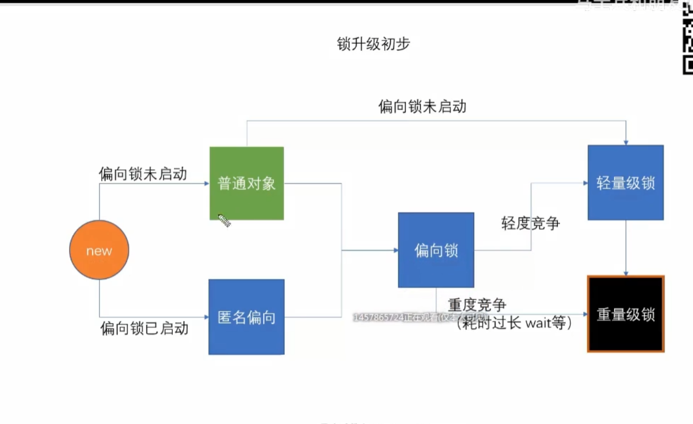
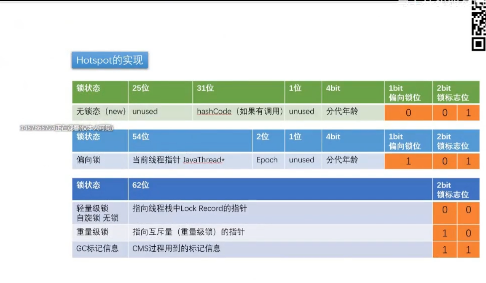
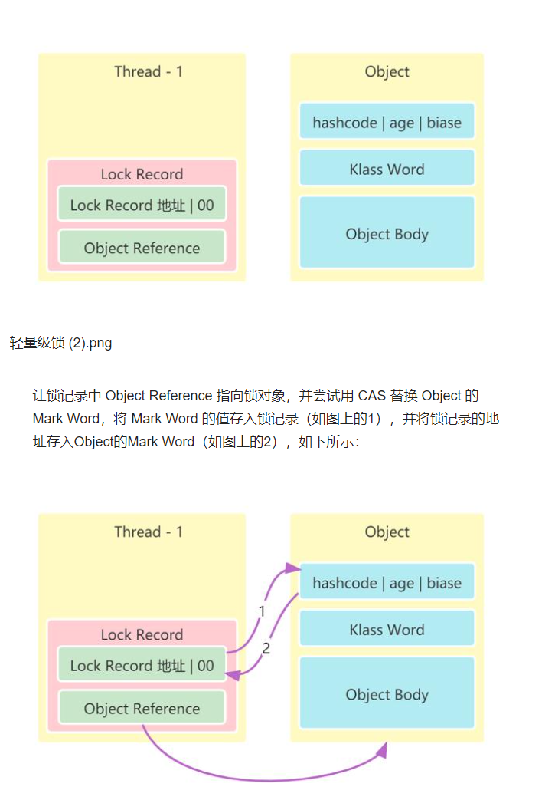
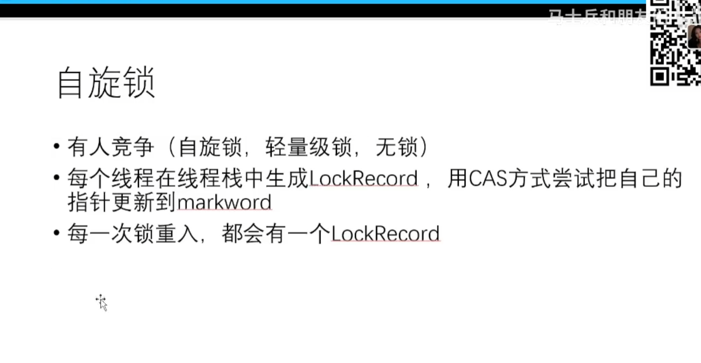
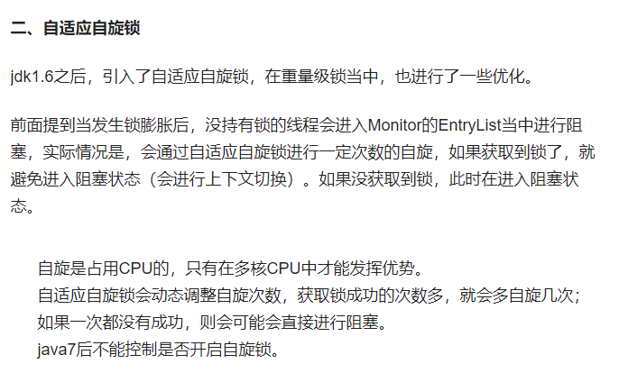

synchronized（可重入，非公平，无法打断，阻塞等待）


CAS 比较 交换

atomic原子类

内部是native方法

compareAndSwap  自旋锁
A :0 -> 1

先读取 a = 0  进行+1 写回去前看是不是a=0 如果别的线程把A从0变成1 那么就是1+1 
再写回去 再读取A= 2 那么就是2+1
一直到  读写读 在前后两个读时 是一致的
这种叫自旋锁

AtomicLong  中  getAndIncrement 方法里面
```
public final long getAndAddLong (Object var1,long var2, long var4){
    long var6;
    do {
        var6 = this.getLongVolatile(var1, var2);
    } while (!this.compareAndSwapLong(var1, var2, var6, var6 + var4));
 
 
    return var6;
}
```
这里的 do-while 循环就是一个自旋操作，如果在修改过程中遇到了其他线程竞争导致没修改成功的情况，就会 while 循环里进行死循环，直到修改成功为止


ABA问题

线程1  0变成1

在写之前：

线程2  0变成2
线程3  2变成0

ABA 解决 用版本号 改一次加一

但这种加版本号无法根本解决问题？

在atomic底部 的 native方法 

C++内部实现 使用了汇编语言 lock cmpxchg 指令
锁定一个北桥信号 不锁定锁总线
如果是多个CPU 只用一个CPU

JOL 

Java对象布局 Java object layout（布局; 布置; 设计; 安排;）

Java对象必须是8的倍数 不足的话补齐

对象头 12个字节   MarkWord 标记文档 8字节  klass pointer 类型指针 4字节

成员变量 如 int 加4字节

synchronized关键字就是对MarkWord的修改

字节码的实现

    monitor exit
    monitor exiter

偏向锁 自旋锁 都是用户空间锁

重量级锁需要向内核申请



偏向锁 空杯归零



把线程ID设置到MarkWord



如果有两个线程  每个线程都有自己的线程栈
在栈内生成lock record 锁记录
获取MarkWord的指针指向自己 有人设过 用自旋锁来竞争
每一次锁重入(
自己可以再次获取自己的内部的锁。比如有线程A获得了某对象的锁,此时这个时候锁还没有释放,当其再次想获取这个对象的锁的时候还是可以获取的
) 都会有一个lockRecord



自旋锁要占CPU 线程过多资源占用激烈
java preSpinLock 默认10 之前是要设置的 自旋次数
现在是adaptive cas 自适应自旋



重量级锁（重量级锁有队列）

objectMonitor

C++底层

1000个线程竞争进入waitset等待
entrylist waitset

打开偏向锁不一定效率会提升
明确知道过多的线程 反复修改MarkWord的信息 效率不一定高

jvm偏向锁默认4s才会打开偏向锁
因为jvm启动过程中知道有很多东西在处理 所以开始不用偏向锁


偏向锁 如果wait时间过长 直接会升级重量级锁

重量级锁是用户态内核态切换，阻塞线程进入等待队列（自旋锁就不会阻塞，但是占用CPU）

编译器将字节码翻译成机器语言 LOCK(前缀) 代表的是总线锁