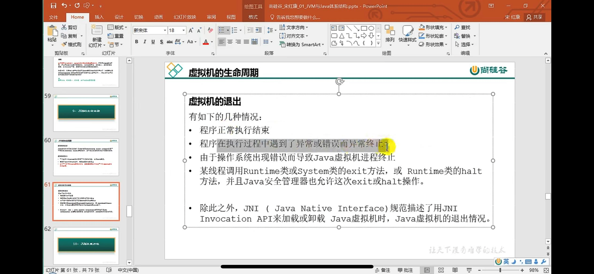
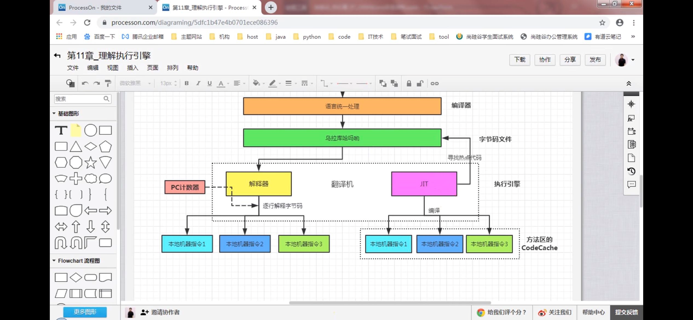
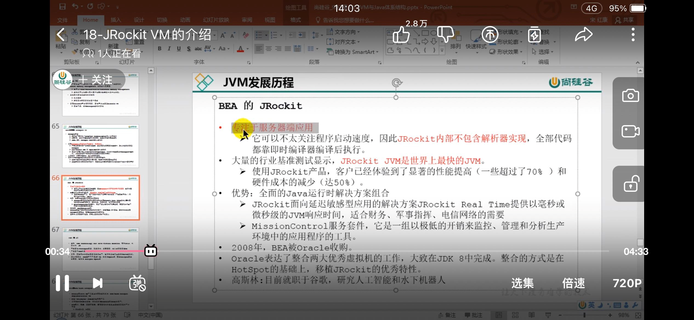

JDK - JRE -JVM

前端编译器 javac编译器 .java 转成.class
前端javac编译器是转成字节码 后端jit编译器转成机器指令

类加载器-》运行时数据区 《-》 本地方法接口 JNI <-本地方法库

-》执行引擎

执行引擎：

解释器（interpreter） 
JIT即时编译器 （JIT compiler）
垃圾回收器（GC）

二次编译 源文件编译成字节码文件，再通过JIT转成机器指令，对于热点 频繁调用的指令，JIT会缓存起来

基于栈式架构（Java虚拟机） 
跨平台性好，指令集小，但是指令多
执行性能比寄存器差

和寄存器架构（PC，Android）
寄存器 的指令更少

JVM启动-执行-结束

启动是通过类引导器创建初始类完成

初始类不是object类，object也是引导类加载器加载的

最早的是sun classic vm

hotspot 
热点探测 计数器探测 多处引用 被循环调用的方法
将其编译成机器指令缓存到方法区的Code Cache

