永久代 -> 元空间

方法区的大小可以决定系统可以保存多少对象类型数据，如果定义了太多的类，会导致溢出：

java.long.outOfMemoryError: MetaSpace

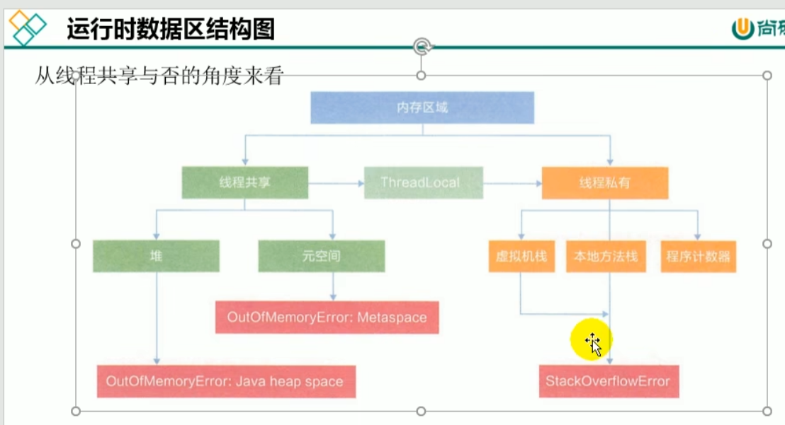

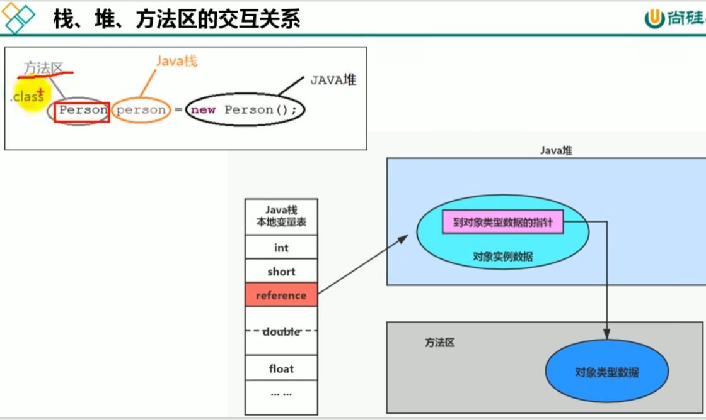

对象的访问定位:句柄和直接指针

jvm是用的直接指针

栈帧保存的对象引用指向对象实例，对象实例的数据保存在堆中，

在实例数据中存放着对象类型数据的指针 指向的是对象类型数据，而这个对象类型数据存放的就是方法区。

    方法区  栈            堆
      |    |             |
    Person person = new Person();

方法区是堆外内存 non-heap 也可以叫直接内存

方法区存储了什么？
---

方法区内主要存放的是类信息，接口，枚举类，注解，静态变量（实体对象还是在堆），常量，方法信息，域信息，即时编译器编译后的代码缓存等。

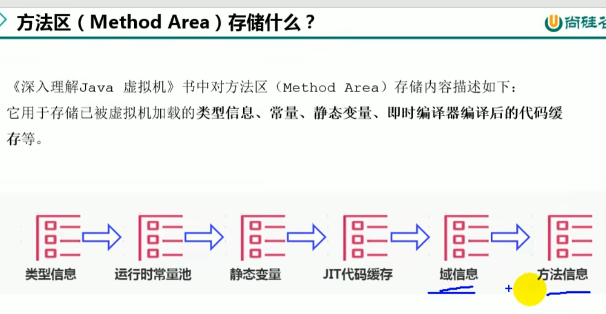

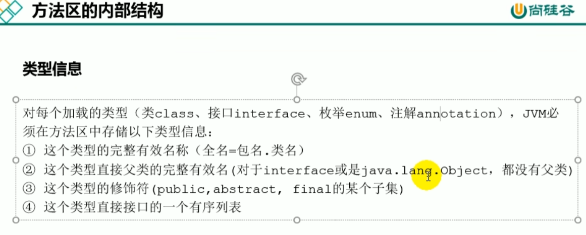

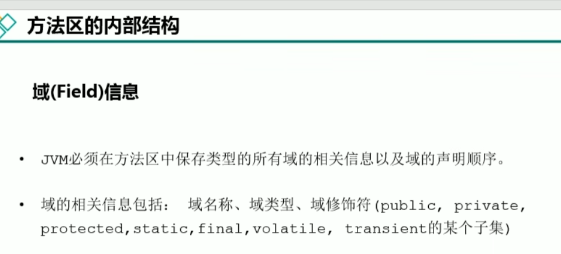

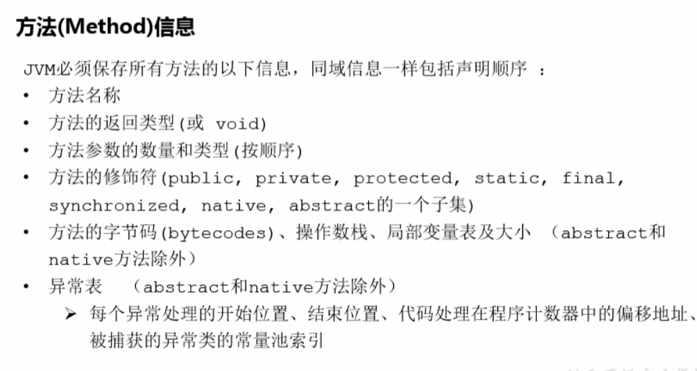

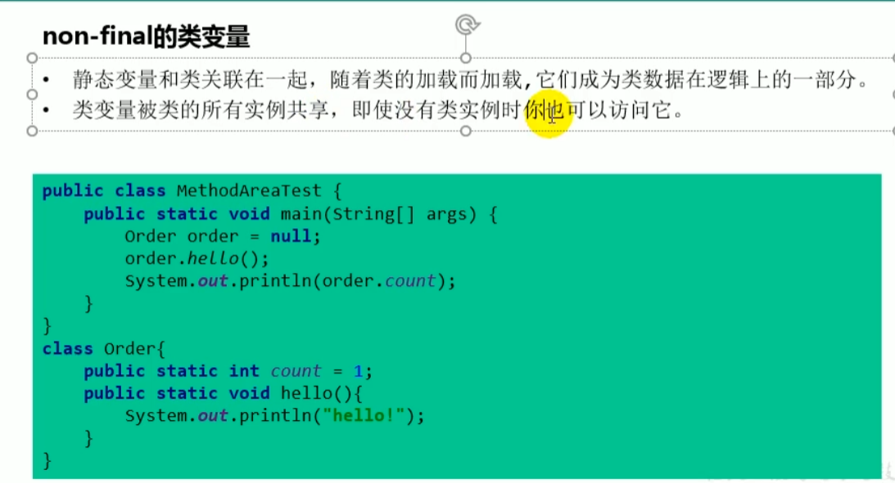

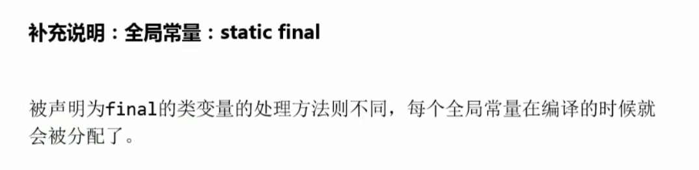

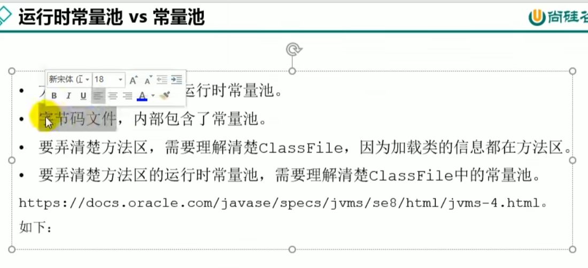

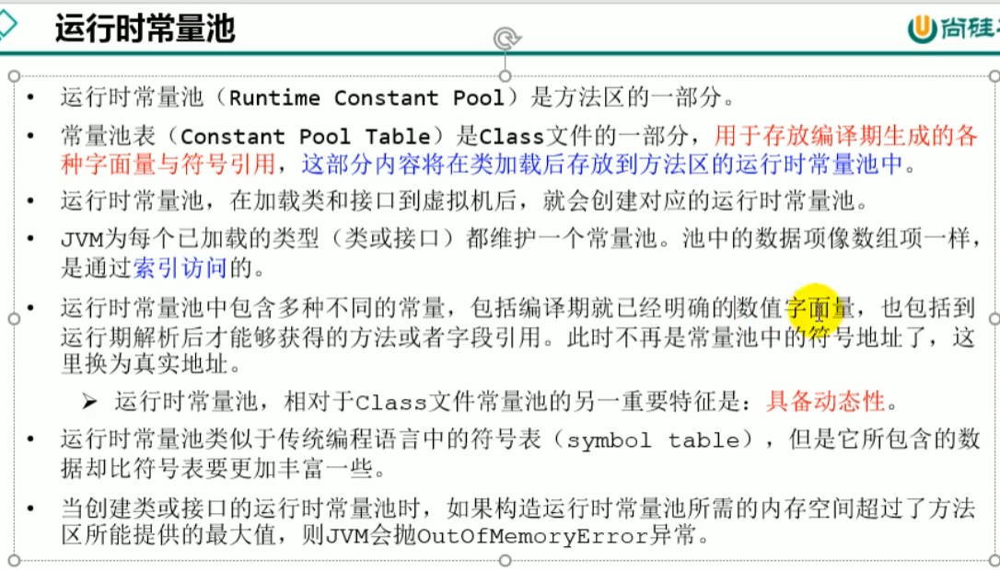

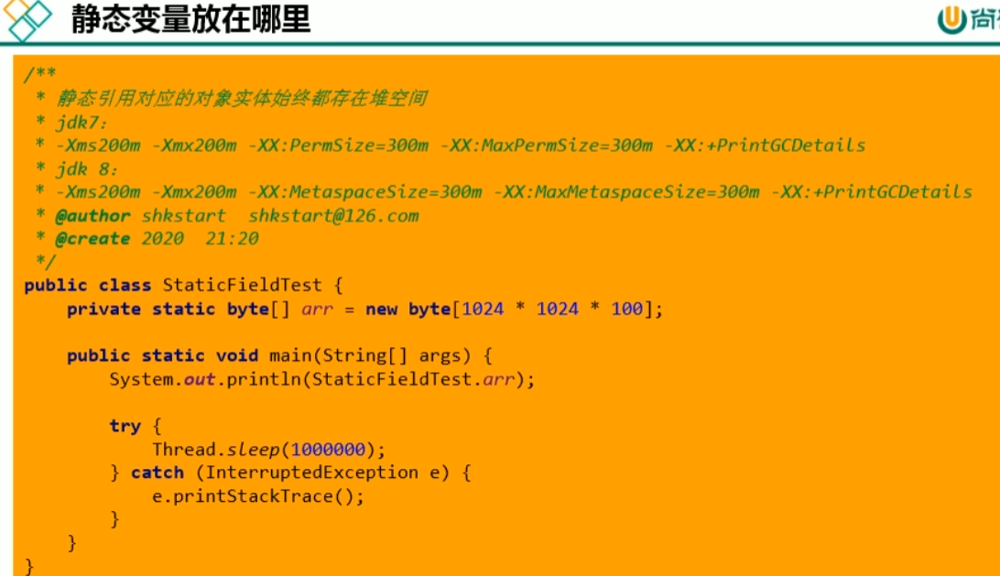

方法区的垃圾回收
---
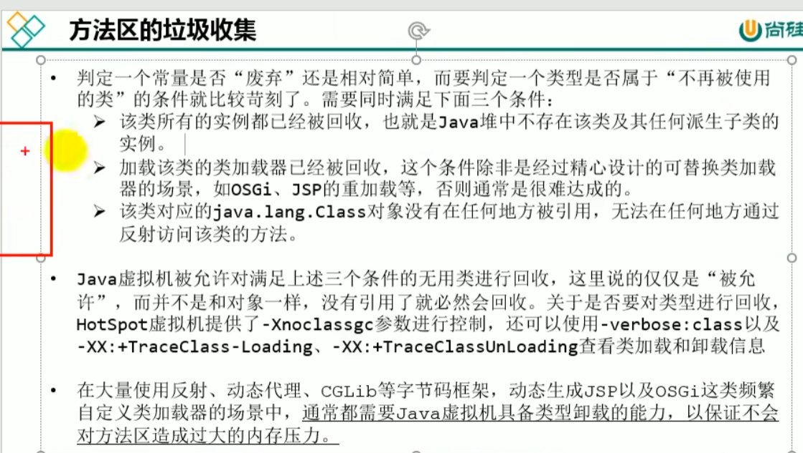