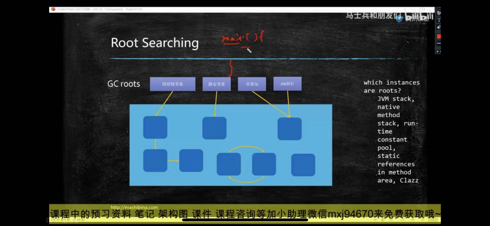

如何确定一个对象是垃圾

reference count 引用计数 
---

有没有引用指向对象
但是无法解决循环引用

root searching 根可达性算法
---

从roots出发，如果一个对象到roots之间没有任何的引用链， 说明该对象不可用，

从roots开始遍历，能遍历到的对象就被判定为存活

没有被遍历到的被判定为死亡，需要被回收

哪些对象可以作为GC roots？
---

虚拟机栈中的引用对象

方法区中类静态属性引用的对象

方法区中常量引用对象

本地方法栈中JNI引用对象

