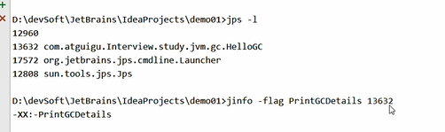
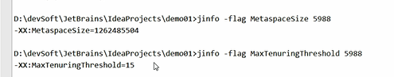
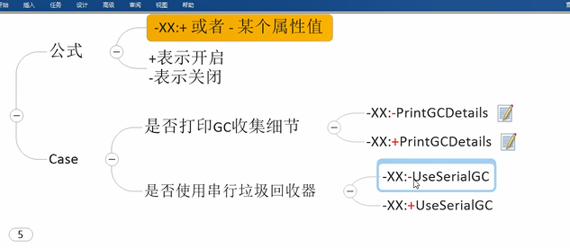

jinfo -flag 查看配置是否开启
---

如 jinfo -flag MetaSpaceSize {PID}

JVM参数类型
---

标配参数

    -version

    -help

    -showversion 
X参数

    -Xint 解释执行

    -Xcomp 第一次使用编译成本地代码

    -Xmixed 混合模式

XX参数

    Boolean类型 -XX:+表示开启 -XX:-表示关闭

    KV设置类型 如 -XX:MetaspaceSize=128m,

    -XX:MaxTenuringThreshoud=15(自动调节对象晋升(Promote)到老年代阈值的GC中,设置该阈值的最大值)

