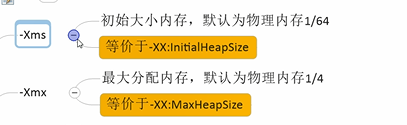
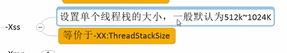
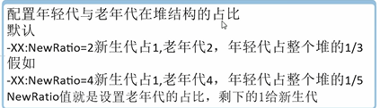
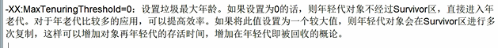

-Xms和-Xmx
---
xms初始化大小 默认物理内存的1/64

xmx最大分配大小 默认物理内存的1/4

-Xss(等价于-XX:ThreadStackSize)
---

设置单个`线程栈`的大小，一般默认为512K~1024k

-Xmn设置年轻代大小
---

-XX:MetaspaceSize
---

使用本地内存

先使用java -XX:+PrintFlagsFinal -version

查看metaspace设置 最开始的时候metaspace就20M

为了避免meta space爆出OOM，需要设置如 -XX:MetaspaceSize=512m

-XX:PrintGCDetails
---

打印垃圾回收前后内存变化

-XX:SurvivorRatio
---

ratio （rui xie er）

设置年轻代中Eden和s0 s1的比例

默认8：1：1

如果设置-XX:SurvivorRatio=4 那么就是4：1：1

SurvivorRatio就是设置Eden的比例 s0 s1比例不变

-XX:NewRatio
---

配置年轻代和老年代的比例

默认 年轻代占1/3 老年代占2/3

如果设置-XX:NewRatio为4

那么就是 年轻代占1/5 老年代占4/5

newRatio值就算设置老年代的占比，剩下的1给年轻代

-XX:MaxTenuringThreshold
---

设置对象经过多少次在S0,S1的垃圾回收后，晋升养老代的次数

 

