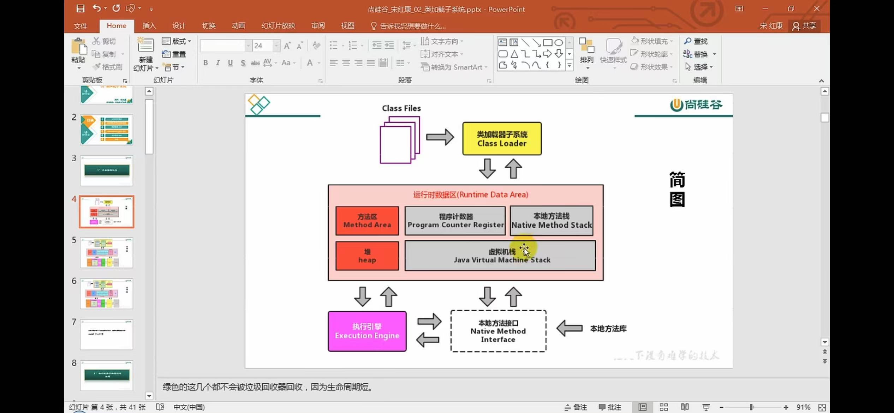
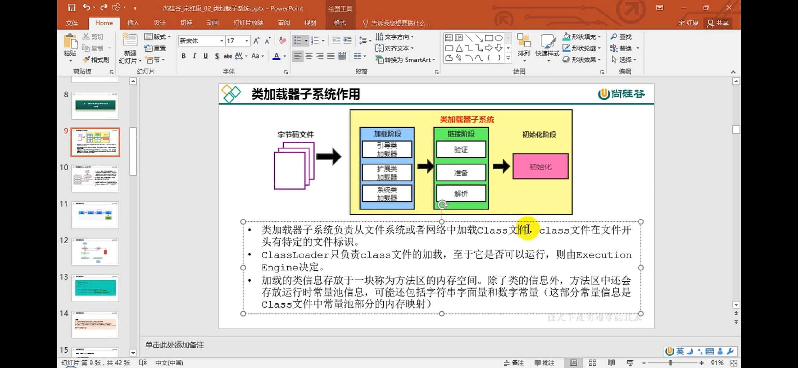
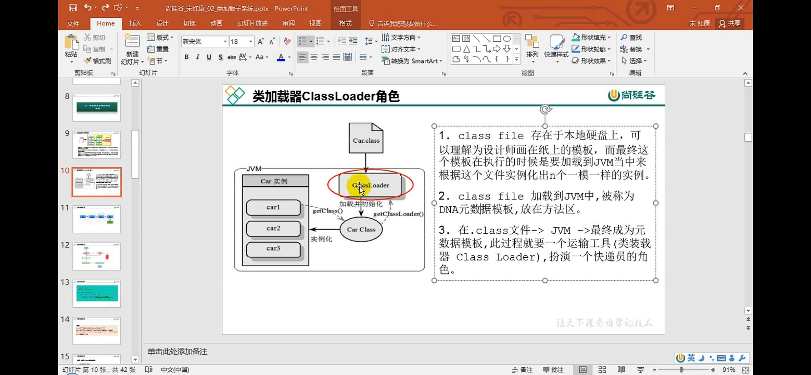

    PC registers 程序计数器
    stack area 栈
    method area 方法区
    heap area 堆
    native method 本地方法栈
    

手写一个简单的虚拟机demo 考虑什么结构？

    1 类加载器 获取类的信息 常量 变量 分配到内存当中
    2 执行引擎 逐条解释指令

class loader 只负责加载到内存 是否可以运行需要execution engine决定

加载-验证-准备-解析-初始化

