idea插件: jclasslib bytecode viewer

    PC registers 程序计数器
    stack area 栈
    method area 方法区
    heap area 堆
    native method 本地方法栈
    

手写一个简单的虚拟机demo 考虑什么结构？

    1 类加载器 获取类的信息 常量 变量 分配到内存当中
    2 执行引擎 逐条解释指令

class loader 只负责加载到内存 是否可以运行需要execution engine决定

加载-验证-准备-解析-初始化

加载
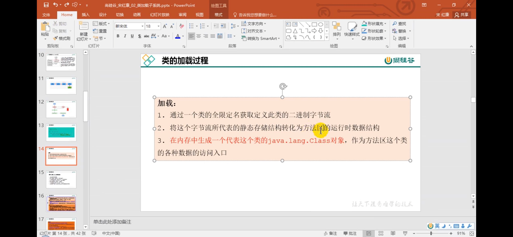

加载
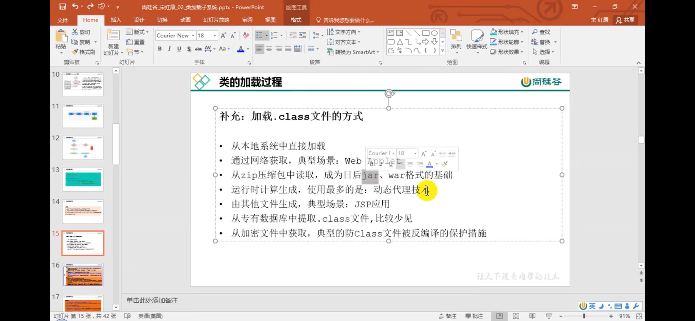

验证-准备-解析
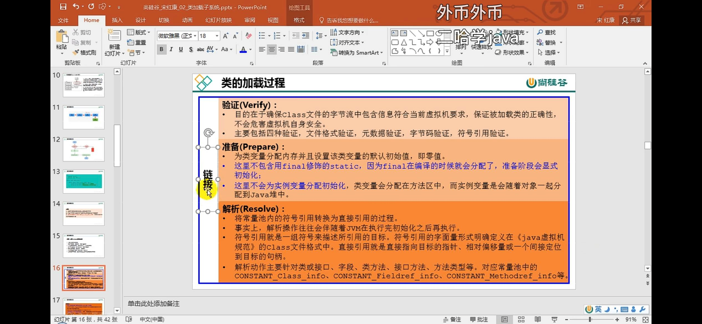

    .class字节码文件开头都是CA FE BA BE

初始化

    clinit 类构造器方法

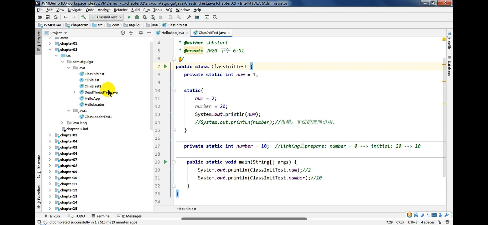

    多线程 static方法块 只会加载一次！

类加载器的分类

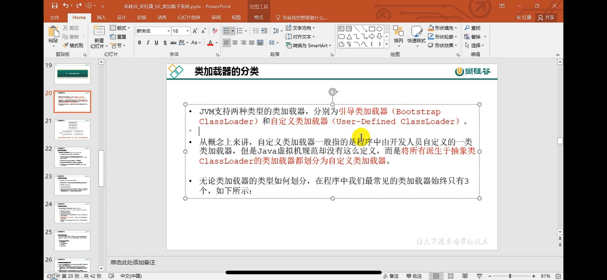

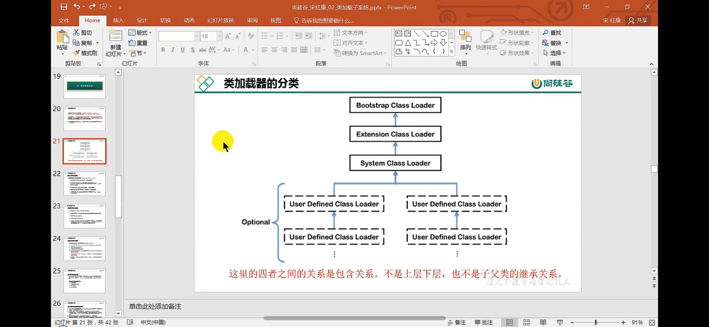

分为两类：

    引导类加载器：
    bootstrapClassLoader 引导类加载器是C/C++编写的

    自定义类加载器：
    extClassLoader, appClassLoader

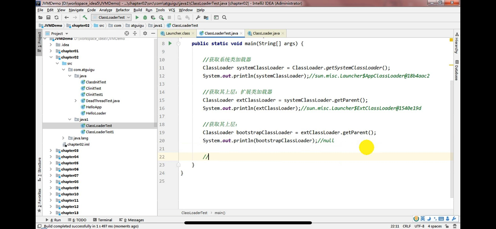

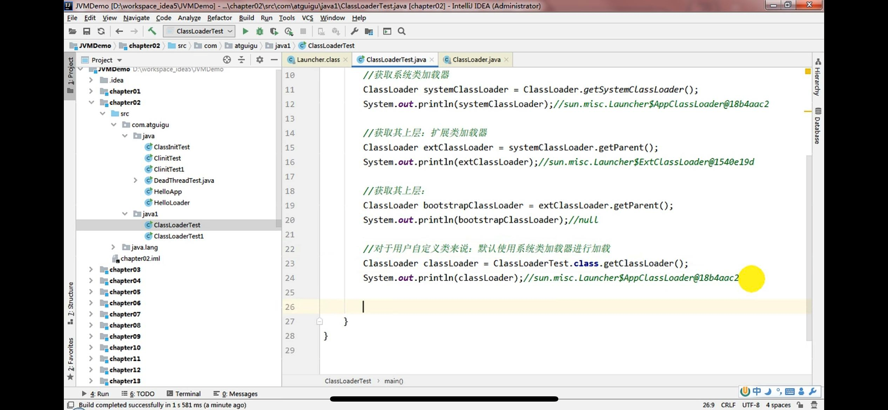

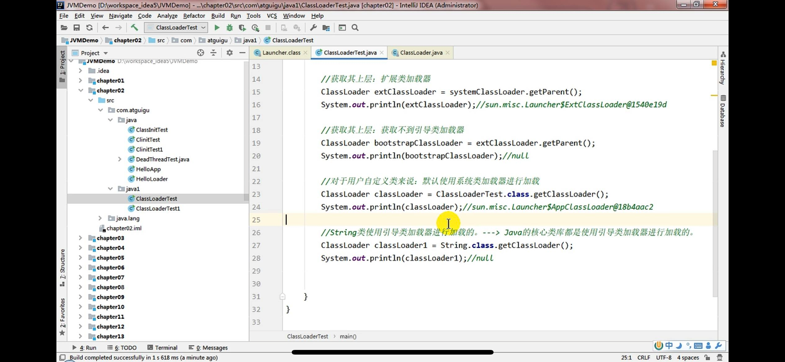

    引导类加载器bootstrapClassLoader是获取不到的

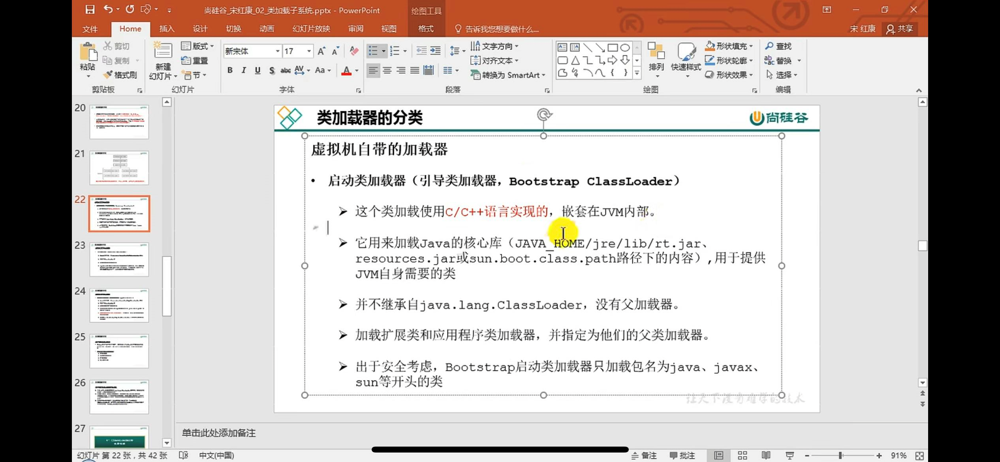

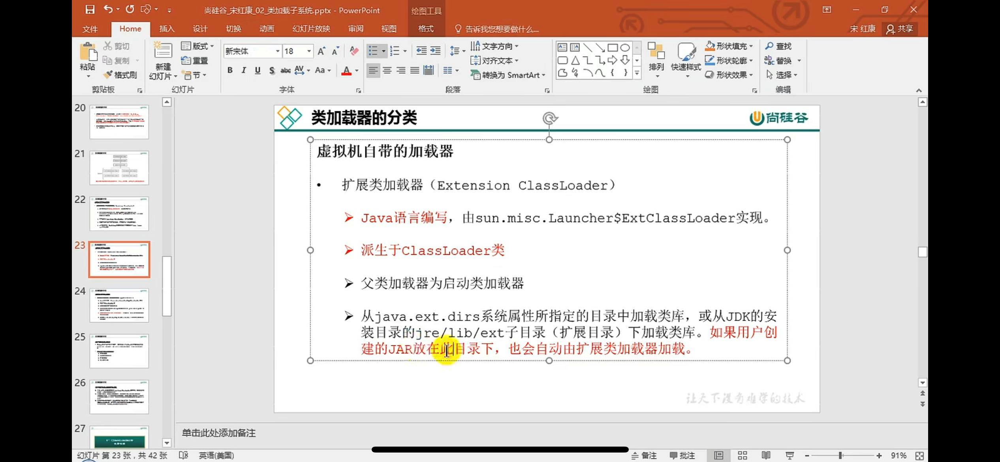

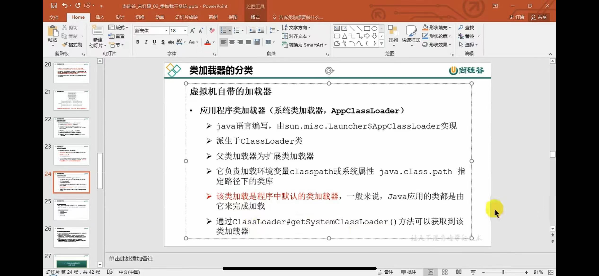

自定义类加载器：

通过继承抽象类classloader

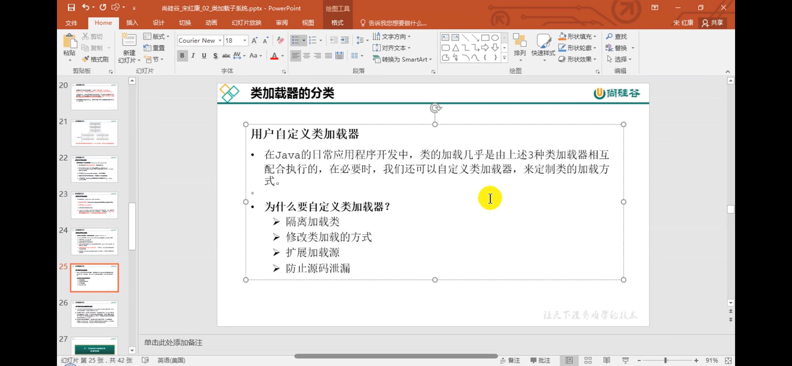

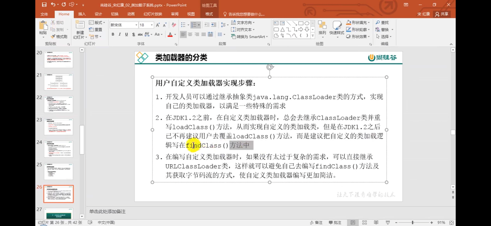

双亲委派机制:
    
    避免重复加载；
    保证安全，防止核心API被随意篡改

    沙箱安全机制

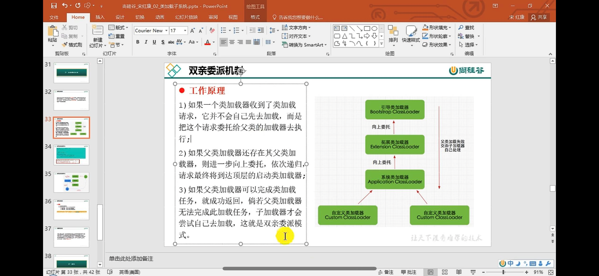

两个class对象是否为同一个类？

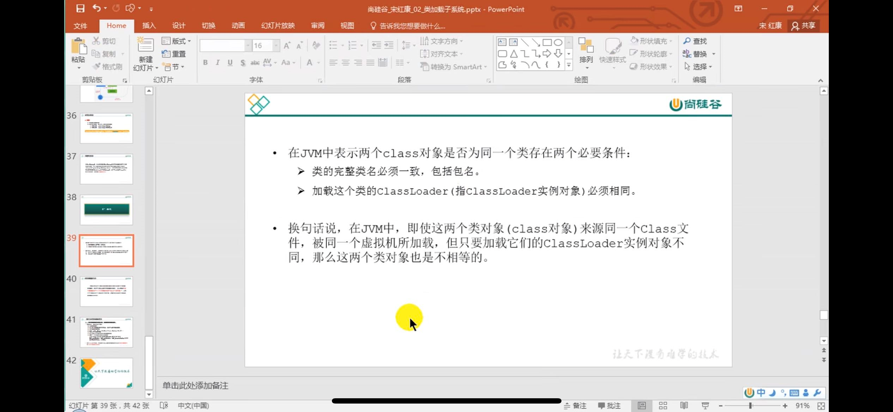

