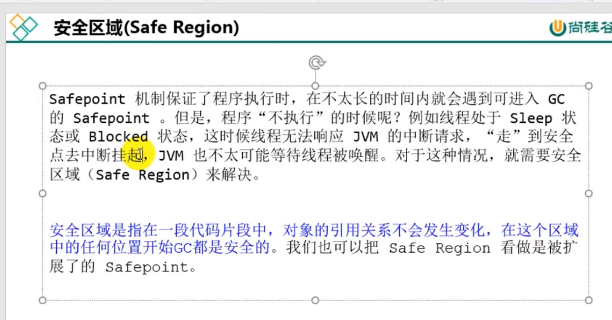

并行 parallel
---

多个垃圾收集线程并行工作，用户线程处于等待状态
如parNew， parallel Scavenge， parallel old

串行 serial
---
单线程执行垃圾回收

并发 concurrent
---
用户线程和垃圾回收线程同时执行

安全点 safe point
---
程序执行时并非所有地方都能停下里开始GC，只有特定位置才能停顿下来。

用户线程执行--->安全点--->GC执行--->用户线程--->

选择安全点的标准时寻找执行时间较长的指令作为safe point：

比如方法调用，循环跳转，异常跳转

安全区域 safe region
---
在一段代码内，对象的引用关系不会发送变化，在这块区域内任何文职开始GC都是安全的。

什么是OopMap
---
GC Roots 枚举的过程中，是需要暂停用户线程的，对栈进行扫描，找到哪些地方存储了对象的引用。

然而，栈存储的数据不止是对象的引用，因此对整个栈进行全量扫描，显然是很耗费时间，影响性能的。

因此，在 HotSpot 中采取了空间换时间的方法，使用 OopMap 来存储栈上的对象引用的信息。

参考：
---
https://zhuanlan.zhihu.com/p/441867302

