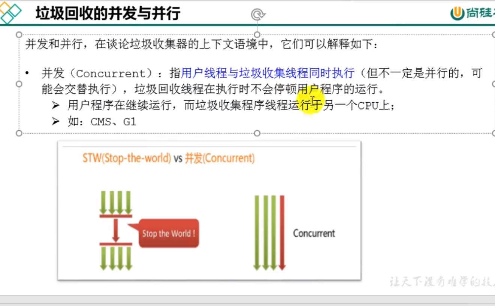
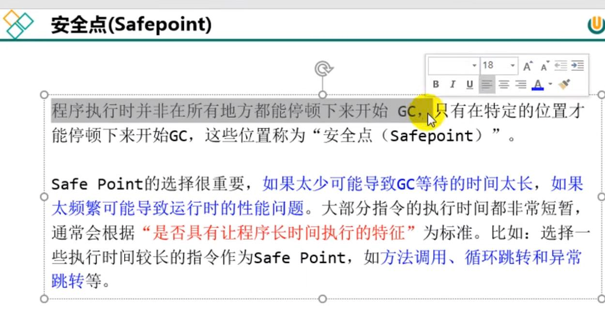

并行 parallel
---

多个垃圾收集线程并行工作，用户线程处于等待状态
如parNew， parallel Scavenge， parallel old

串行 serial
---
单线程执行垃圾回收

并发 concurrent
---
用户线程和垃圾回收线程同时执行

安全点 safe point
---
程序执行时并非所有地方都能停下里开始GC，只有特定位置才能停顿下来。

用户线程执行--->安全点--->GC执行--->用户线程--->

选择安全点的标准时寻找执行时间较长的指令作为safe point：

比如方法调用，循环跳转，异常跳转

