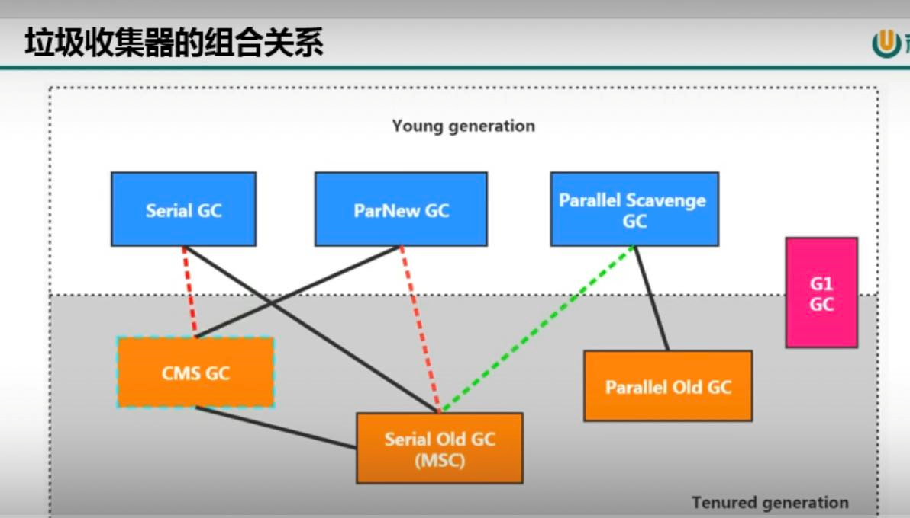

评估GC性能指标
---

吞吐量：运行用户程序代码占系统总运行时间的占比（程序运行时间+内存回收时间）

暂停时间:执行垃圾回收时间，用户线程被暂停的时间。

部分垃圾回收器和内存分代的关系
---
young gen(年轻代收集器):
 serial gc, parallel scavenge gc, parNew gc

old gen(老年代收集器):
 serial old gc, parallel old gc, cms gc

整堆收集器：
  G1 GC

4种主要的累计回收器
---

serial串行垃圾回收器(-XX:UseSerialGC)
---

    只有一个垃圾回收线程来回收垃圾 会暂停所有用户线程（STW）

parallel并行垃圾回收器(-XX:UseParallelGC)(Java8默认)

    有多个垃圾回收线程来回收垃圾 会暂停所有用户线程（STW）

CMS并发标记垃圾回收器

    在初始标记垃圾时 会暂停所有用户线程（STW）

    在进行垃圾回收时，垃圾回收线程和用户线程可以同时运行（或者说交替运行）

G1垃圾回收器

    将内存对象分区 对区域内的垃圾进行回收  标记阶段也会有（STW）