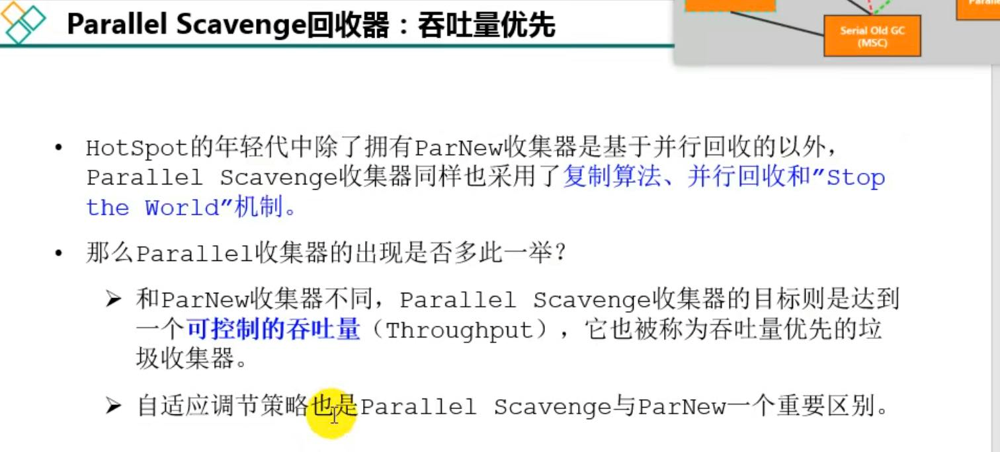
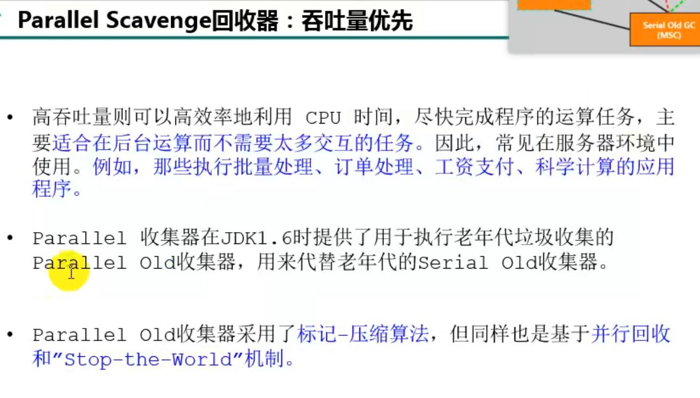
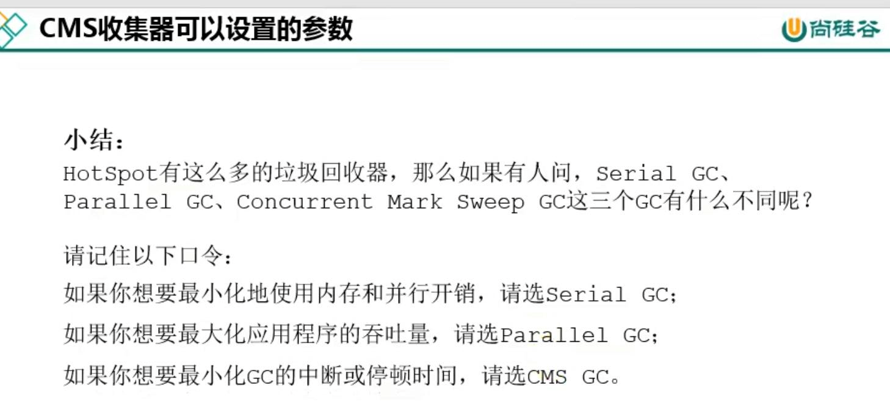

parallel scavenge回收器（年轻代）
---
并行回收， 复制算法， 有‘stop the world’机制

以实现系统的吞吐量优先,比如说一些CPU密集性的任务，财务结算，科学计算之类的。

parallel old回收器（老年代）
---
替换serial old收集器，并行处理，标记-压缩（整理），有‘stop the world’机制

Java8默认就是parallel 和 parallel old组件作为默认垃圾回收器。

