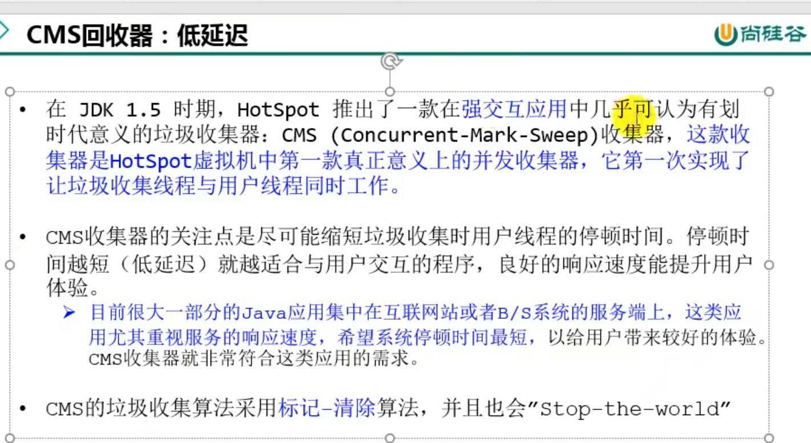
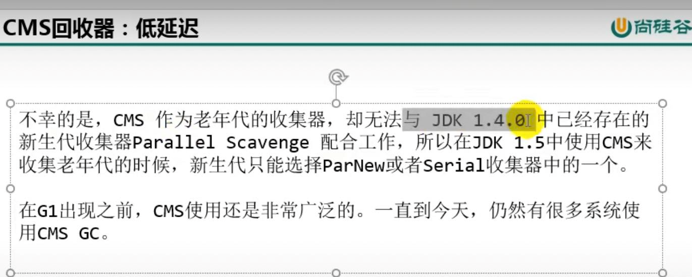

全称concurrent-mark-sweep
---
CMS收集器(JDK 1.5)
---
第一次同时实现用户线程和回收线程同时工作的收集器

标记-清除（有内存碎片），有‘stop the world’机制

开启CMS
---
-XX:UseConcMarkSweepGC

CMS工作原理
---

CMS执行流程
---
    初始标记（STW）
    
    并发标记（和用户线程并行）
    
    重新标记（STW）
    
    并发清理（和用户线程并行）
    
    重置线程

初始标记的时候会触发‘STW’，但时间较短，速度很快，所以号称低延迟。

其他阶段则不会触发‘STW’

内存使用到一定阈值后即开始回收，不是等到最后快满的时候再用。

为什么CMS使用了标记-清除，而不是使用标记-压缩算法？
---

因为是并发清理垃圾，

如果使用了标记-压缩算法，

那么对象内存地址必须重新整理，移动地址，

栈中的对象引用地址必须要跟着修改。

这时候用户线程还在执行，对象地址已经修改了。就会出问题。

为什么CMS后备使用了SerialOldGC？

由于用户线程和垃圾回收线程并发进行，会增加对堆内存的占用

CMS必须在老年代堆内存用尽前完成垃圾回收 否则CMS回收失败 会使用serialOldGC（串行垃圾回收器）

造成较大的停顿时间

