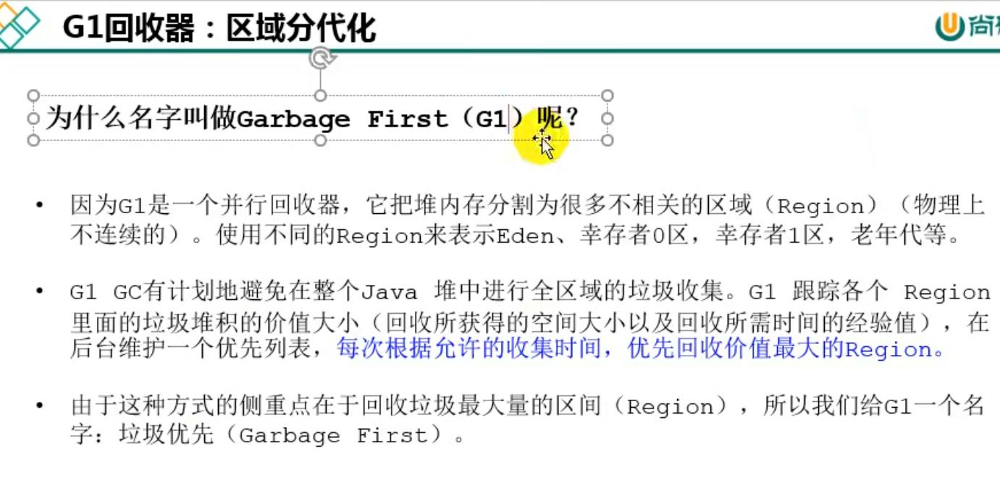
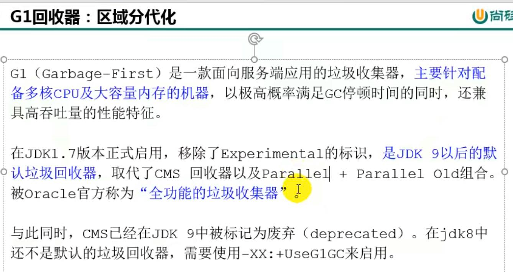
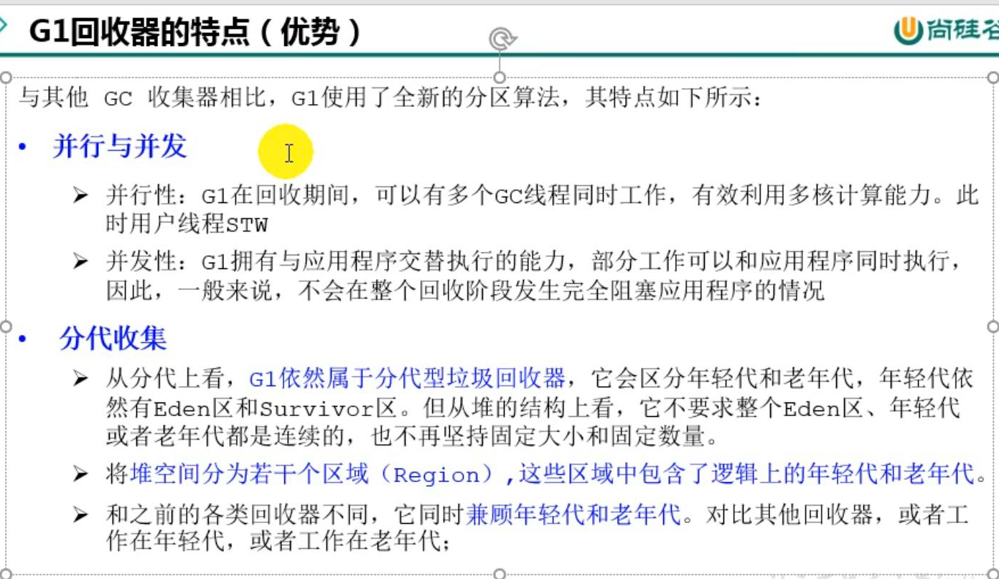
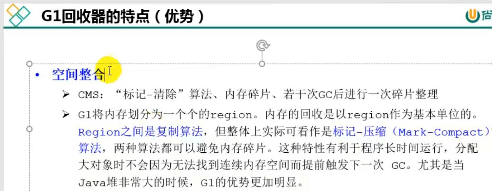
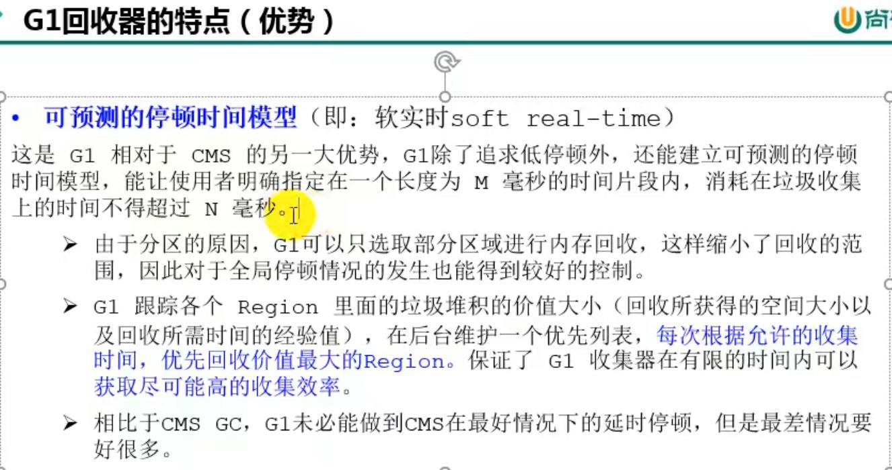
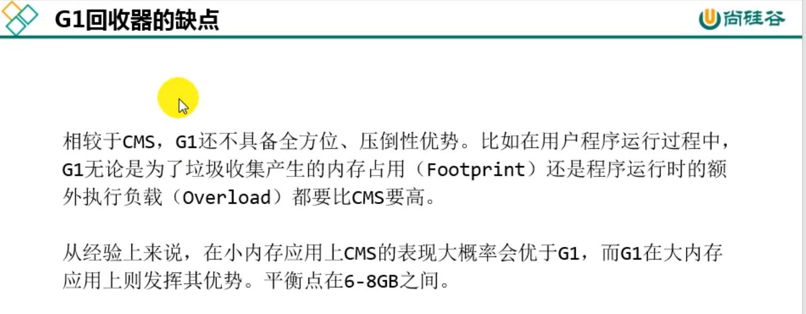
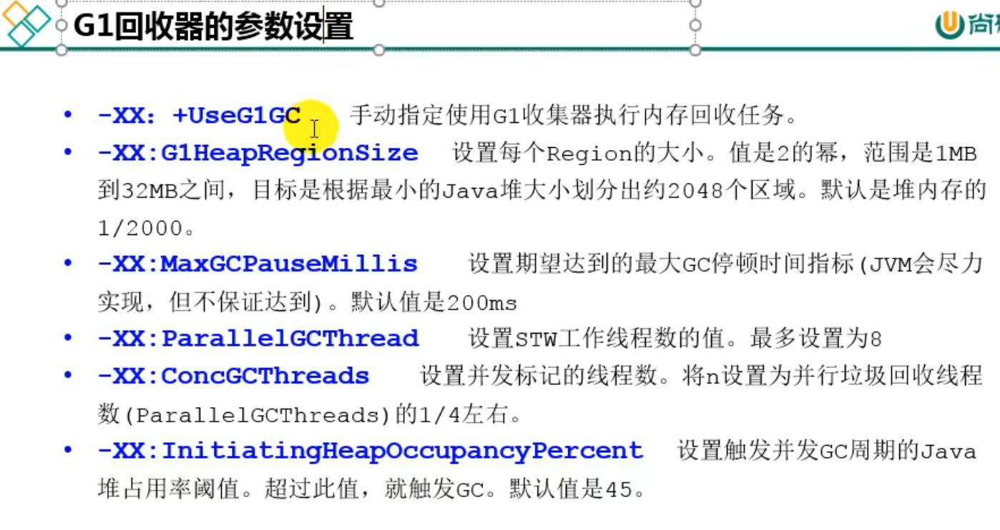
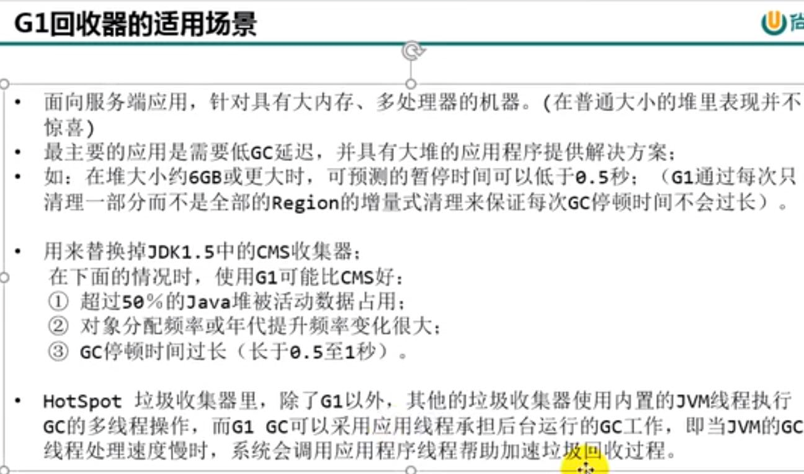

官方文档：
---
https://www.oracle.com/technical-resources/articles/java/g1gc.html

G1（garbage first）收集器 区域分代化
---
在Java 7 引入的垃圾收集器， 从Java 9开始成为默认回收器。

针对多核CPU及大容量内存机器上的服务。

把堆内存分割成多个区域region（物理上不连续的） 而Eden,survivor1,survivor2.old分布在这些region中。

在多核情况下，GC线程同时执行，有‘stop the world’机制。

GC线程在垃圾收集部分阶段可以与用户线程交替执行。

CMS是标记清除会有内存碎片，在若干次后有碎片整理。

G1中region回收时，region用的时复制算法，region1 进行垃圾回收后，会将数据复制到region2中

但是整体上看 多个region被回收后，剩下的region会整理, 就可以看成 标记-压缩。

由于分区原因，G1只选取部分region进行回收，而不是像之前整个Eden，old进行回收。

s

常用配置
---

    -XX:G1HeapRegionSize
    G1划分出的每一个Region的大小。
    默认会根据最大堆的大小，按照划分出2048个region来计算出每个region的大小，根据人体工程学确定的最大值为32M，用户可自定义的范围是1~512M，且必须是2的幂。

    -XX:MaxGCPauseMillis
    期望的最大GC暂停时间，默认为：200ms。

    -XX:ParallelGCThreads
    垃圾收集暂停期间用于并行工作的最大线程数。
    默认根据运行JVM计算机的可用线程数决定，计算方式：当进程可用的CPU线程数小于等于8时，则直接使用该数，否则，将设置为：8 + (n - 8) * (5/8) 。
    在每次暂停时，使用的最大线程数还需要考虑最大堆的限制，即参数：-XX:HeapSizePerGCThread。

    -XX:ConcGCThreads
    用于并发工作的最大线程数，默认情况下，此值为：-XX:ParallelGCThreads除以4。
    如果你想要能够更快的完成并发标记，则可以适当增加并发标记的线程数量。

