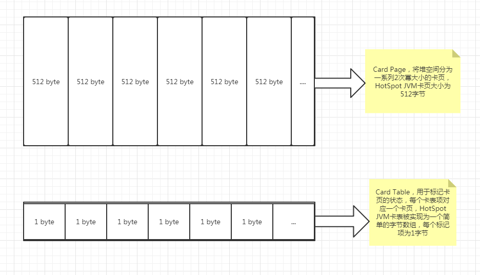

卡表（字节数组）
---

在内存中已byte字节形式存储

数组中的每一个元素 被叫做 卡页 card page

卡页大小为2的N次幂 hotspot中为512字节

一个卡页的标记一块内存区域，这个内存区域的对象可能不止一个 

但只要卡页内的一个对象（或多个）存在跨代引用，那就即将对于卡表中的数据元素设为0，标识这个元素变dirty（变脏）了

在垃圾回收时 根据卡表得出里面哪些卡页包含了跨代引用，把它们加入GC root一起扫描。

写屏障
--

写屏障分为 写前屏障和写后屏障

除了G1收集器，其他收集器只用了写后屏障

进行写操作时 中断 判断字段是否是别的region的 是的话 把卡页变脏

    void oop_field_store(oop* field, oop new_value) {
    // 引用字段赋值操作
    *field = new_value;
    // 写后屏障，在这里完成卡表状态更新
    post_write_barrier(field, new_value);
    }

Remembered Set和Card Table是什么关系呢？
---

A card table is a particular type of remembered set.

卡表是一种特殊类型的记忆集

G1每一个Region都会对应Remembered Set，

它会记录这个Region清理时需要扫描哪几个Region。

之所以这么做的原因是因为G1是分了Region，

如果只使用Card Table，那么就可能不能发挥Region的作用，

甚至会变成FULL GC。所以当card table更新后，会异步的去更新remembered set。

参考
---

https://zhuanlan.zhihu.com/p/354311954