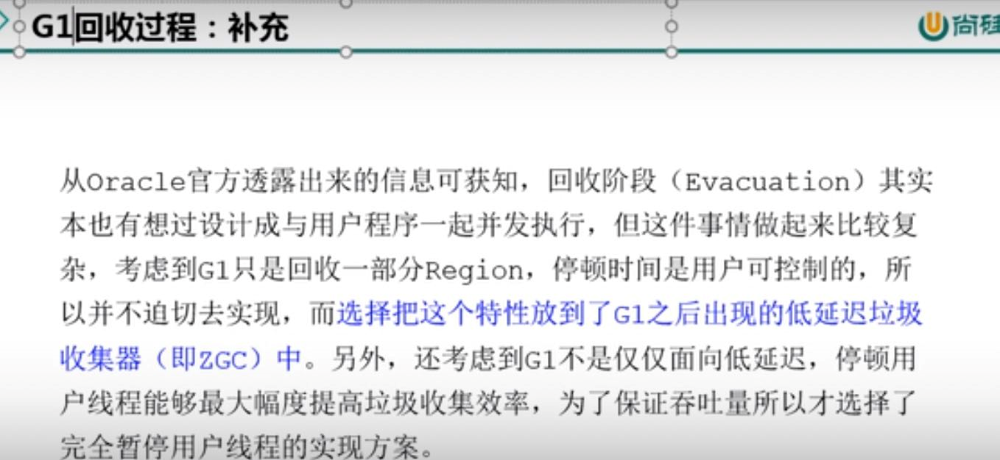

标记复制和标记压缩
---

在回收Eden和survivor时，使用标记复制 会将Eden和survivor

合并到一个新的survivor中，新的survivor多数都是和其他已使用的region相邻的

也可以说在垃圾回收时，同时使用了标记复制和标记整理

humongous
---

在G1中，增加一个humongous存放大对象， 如果超过0.5个region，就会放到humongous里，

如果找不到连续的humongous空间存放这个大对象，就会触发Full GC, 

G1多数都是将humongous作为old的一部分来看待。

独占式（STW）

垃圾回收过程 remembered set
---

remembered set 记忆集（记录不同代的region中 对象的引用问题）

处理 `跨代引用`的问题

每一个 `region`中都有一个 `remembered set`

每次reference对象类型的数据在写操作时，都会触发写屏障中断操作

判断写入的数据的引用指向的对象是否和该reference对象类型数据

是不是在一个region中， 如果A中的属性B的地址不是在一个region中

通过`card table`把这个引用关系，记录到属性B的所在region中的那个remembered set

当进行垃圾扫描时，在GC根节点加入remembered set,避免了全局扫描，也不会又遗漏。

write barrier 写屏障

carb table 卡表

