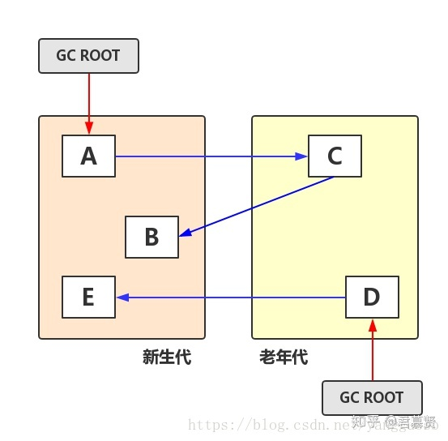
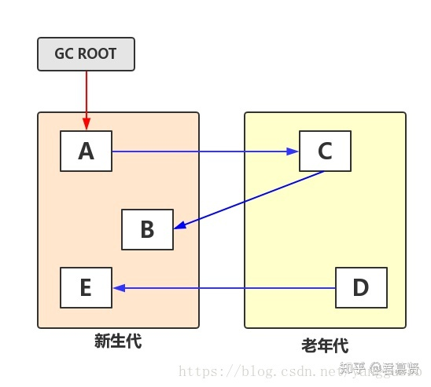

跨代引用是指新生代中存在对老年代对象的引用，或者老年代中存在对新生代的引用，如下图所示

YGC时，为了找到年轻代中的存活对象，不得不遍历整个老年代；

反之亦然。这种方案存在极大的性能浪费。因为跨代引用是极少的，

为了找出那么一点点跨代引用，却得遍历整个老年代！

解决方案：记忆集　　
---

记忆集就是用来记录跨代引用的表，通过引入记忆集避免遍历老年代。

以YGC为例说明，要回收年轻代，只需要引用年轻代对象的GC ROOT+记忆集，

就可以判断出Young区对象是否存活，不必再遍历老年代。

缺点：具有“滞后性”，浪费一定的空间；

如下图所示，YGC时实际上对象E可以被回收，

但是由于没发生FGC，老年代中的对象D仍存在对对象E的引用，导致E无法被回收。

