Java中数据类型分为基本数据类型和引用数据类型

基本数据类型由虚拟机预先定义 不需要加载

而引用数据类型则需要进行类加载

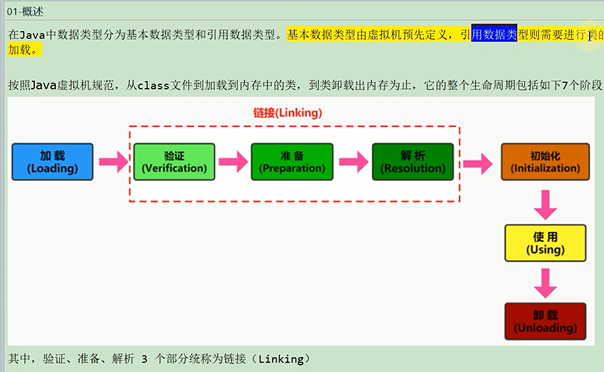

classloader的作用只在类加载阶段

无法改变类的链接和初始化行为。

而类是否能运行，是由执行引擎（execution engine）决定的

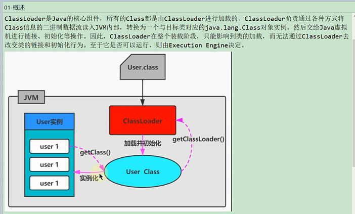

类的加载分类(显式加载,隐式加载)
---

显式加载比如Class.forName(name)

this.getClass().getClassLoader().loadClass()

隐式加载通过虚拟机自动加载到内存 比如new Class()

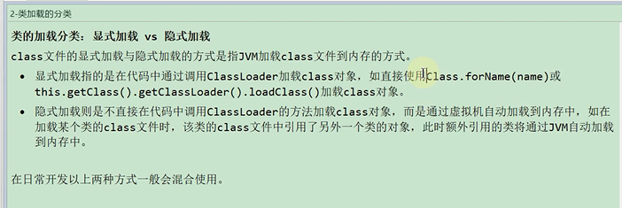

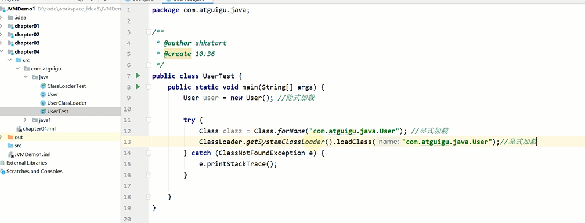

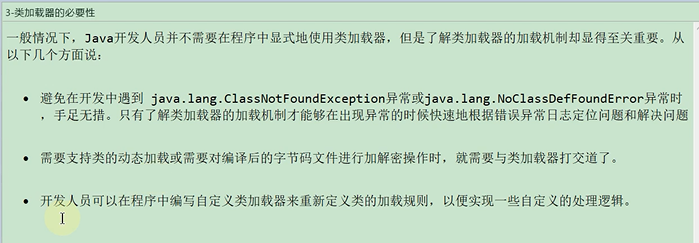

命名空间
---

不同的类加载器，加载的类不相等。即使是一个class文件

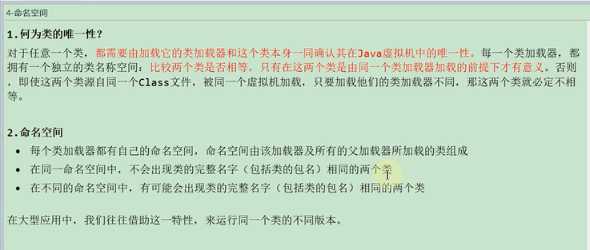

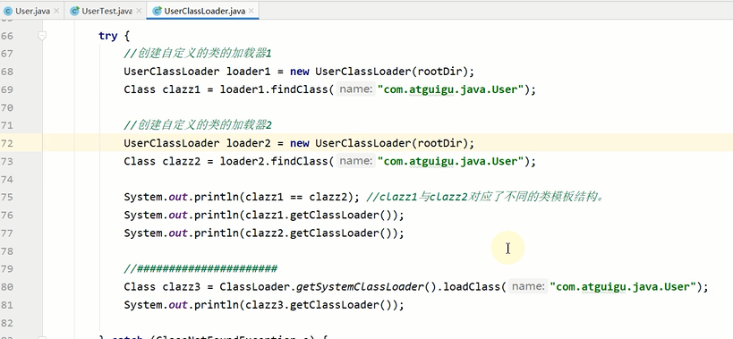

类加载器的基本特征
---
同一类型的加载器，加载的类是互不可见的

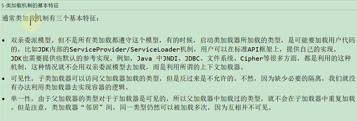

类加载器的分类
---

引导类加载器
---

除了bootstrap class loader 是系统类加载器

其余的包括extension class loader ，application class loader 

和用户自定义的 class loader 都是 自定义加载器

前者由 C，C++编写，后者由Java语言编写

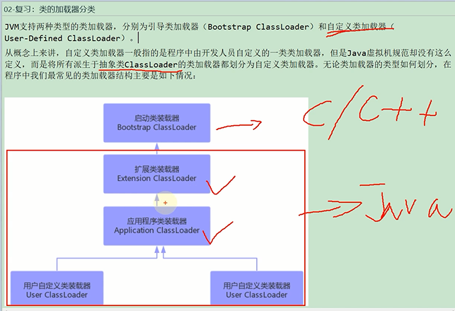

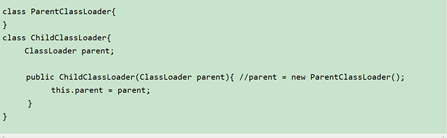

扩展类加载器
---

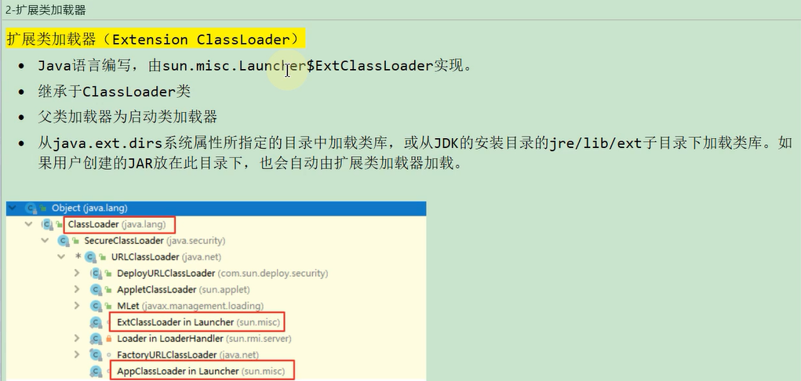

应用程序加载器
---

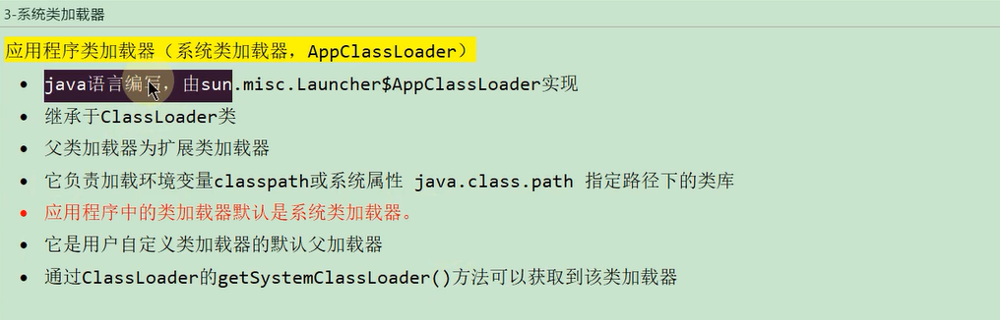

用户自定义加载器
---

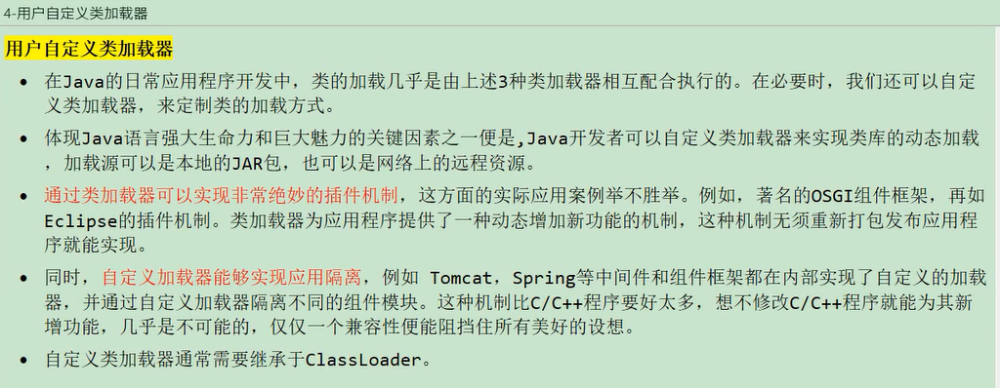

abstract ClassLoader
---

自定义类加载器都需要继承ClassLoader

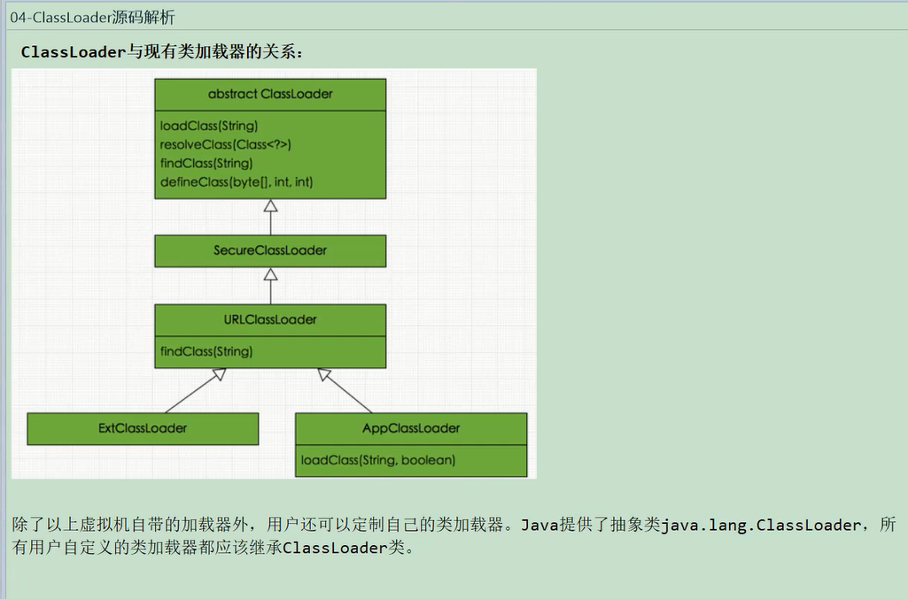

Launcher
---

在launcher中创建AppClassLoader和extClassloader

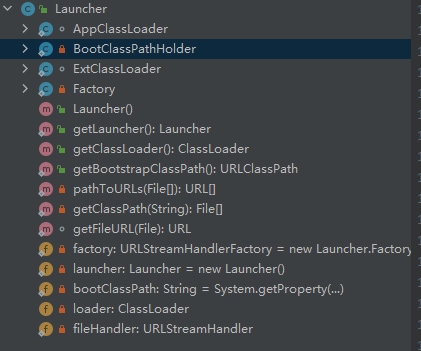