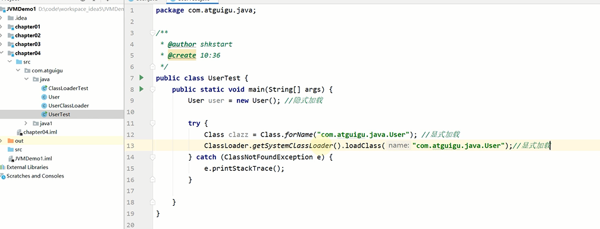

classloader的作用只在类加载阶段

无法改变类的链接和初始化行为。

而类是否能运行，是由执行引擎（execution engine）决定的

类的加载分类(显式加载,隐式加载)
---

显式加载比如Class.forName(name)

this.getClass().getClassLoader().loadClass()

隐式加载通过虚拟机自动加载到内存 比如new Class()

命名空间
---

不同的类加载器，加载的类不相等。即使是一个class文件

类加载器的基本特征
---

