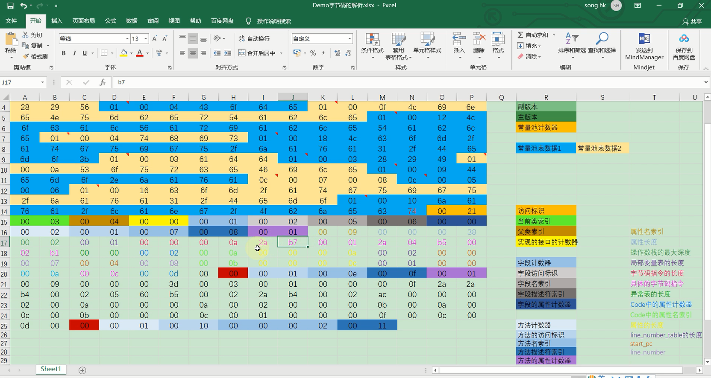
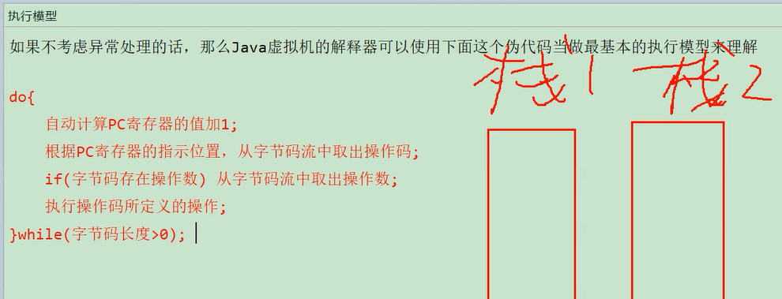
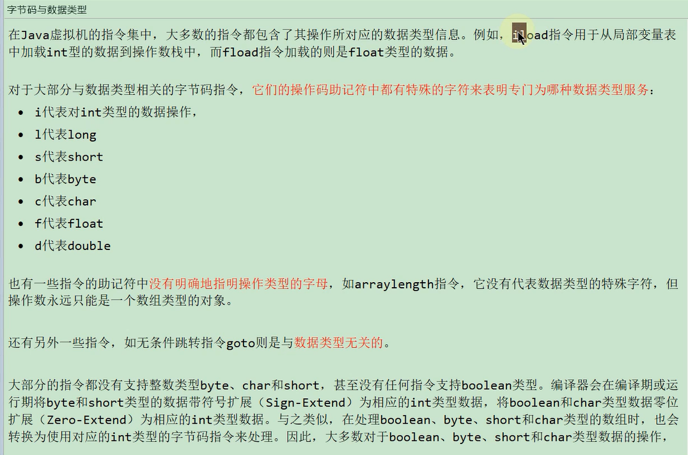
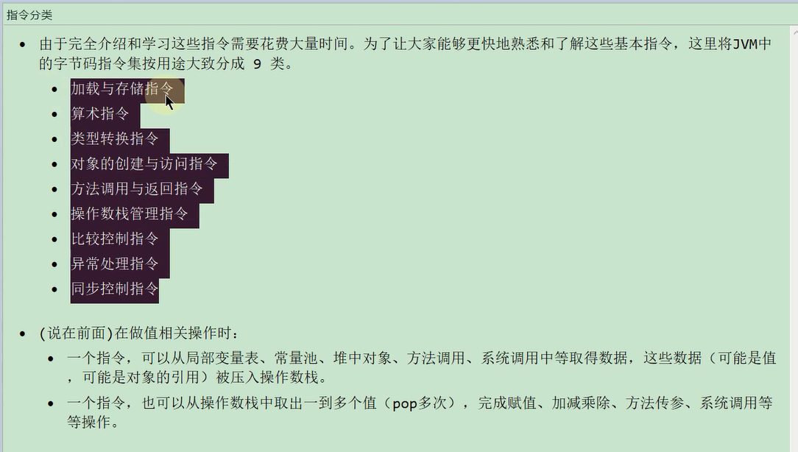

字节码解析
---

概述
---

    操作码和操作数都在操作数栈中

虚拟机的指令有256个 每个指令长度只能有1个字节， 0-255

invoke special 就是操作码 后面的 #号加数字就是操作数

操作数指向了class文件中的常量池（不同于运行时常量池，运行时常量池是方法区的一部分）

Java基础-JVM内存管理-常量池与运行时常量池：https://www.jianshu.com/p/e49bab4e44a6

而aload0 icon st_1之类的只有操作码 ，没有操作数

  

执行模型
---

根据PC寄存器 指示的位置 从字节码流中 取出 操作码 和 操作数

字节码与数据类型
---

a开头的操作码大多是引用类型

i开头的是int

l开头的是long

s开头的是short

b开头的是byte  

c开头的是char

f开头的是float

d开头的是double

 

大多数字节码指定都不支持 整数类型 char short byte

编译器会将这些转换为int类型 作为运算单位

指令分类
---

