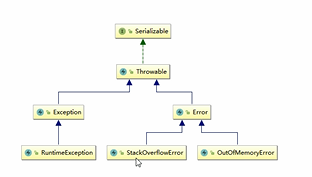
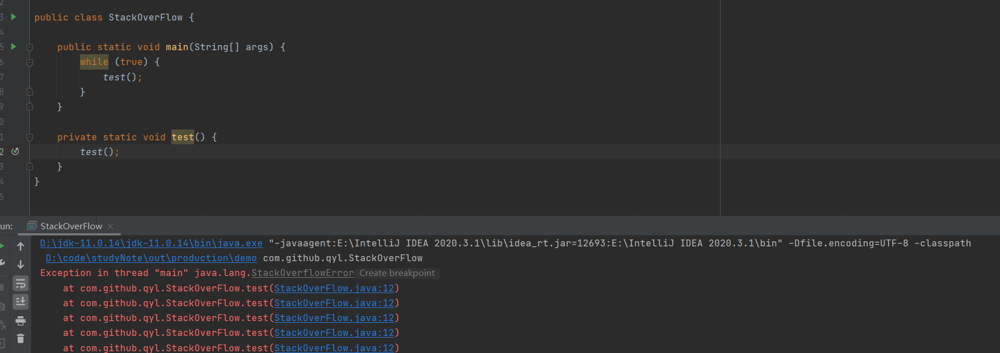
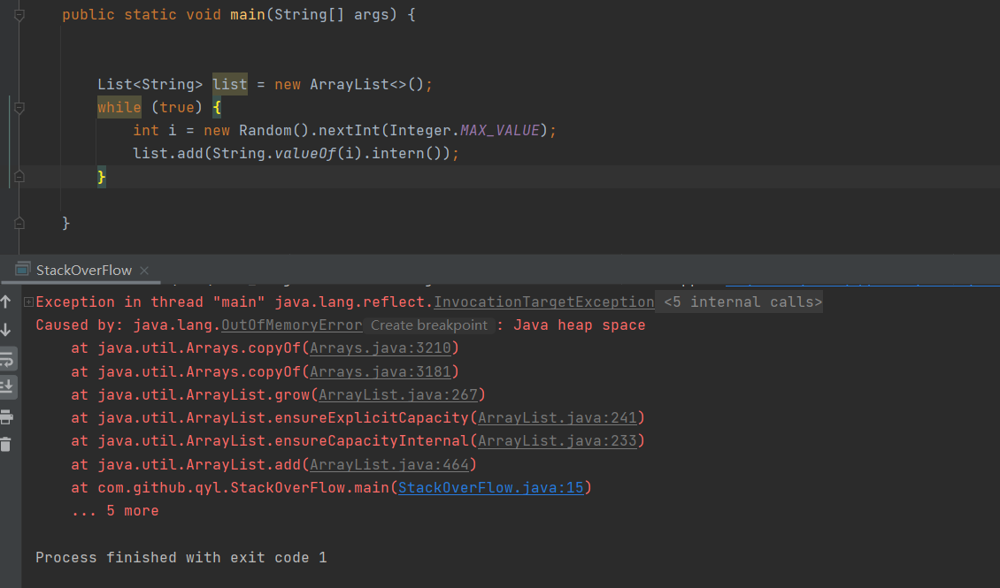
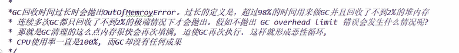
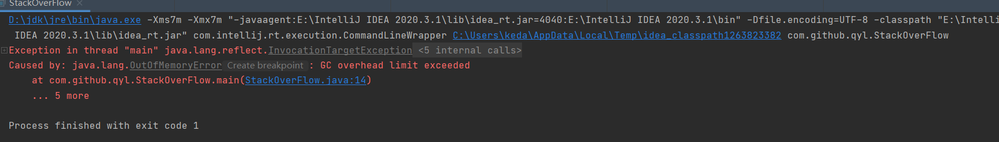
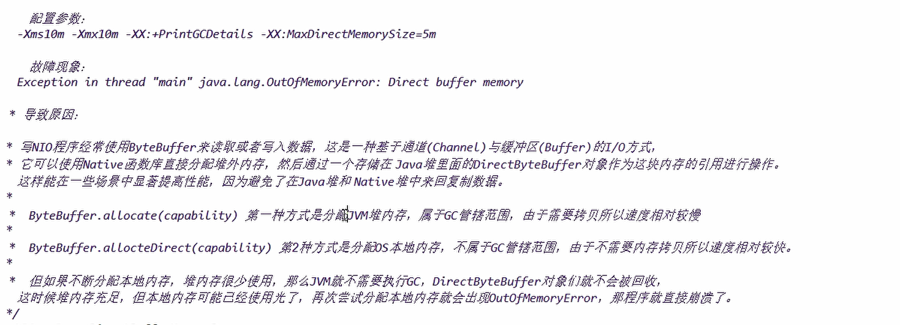
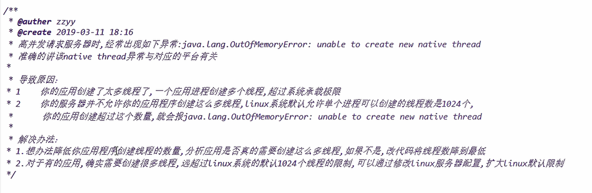
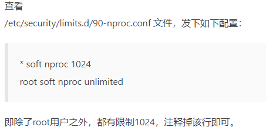

StackOverFlowError
---

OutOfMemoryError: Java heap space
---

OutOfMemoryError: GC overhead limit exceeded
---

默认情况下，启用了 UseGCOverheadLimit，连续 5 次，碰到 GC 时间占比超过 98%，GC 回收的内存不足 2% 时，会抛出这个异常。

OutOfMemoryError: Direct buffer memory
---

检查是否直接或间接使用了 nio ，

例如手动调用生成 buffer 的方法或者使用了 nio 容器如 netty， jetty， tomcat 等等；

OutOfMemoryError: unable to create new native thread
---

超过操作系统对单个进程允许创建线程的限制，就会报错unable to create new native thread

解决方案
    
    使用jstack 查看线程信息 是否有大量阻塞的线程 排除原因

    降低应用程序创建线程的数量

    修改Linux配置 扩大Linux默认限制

    检查内存 是否有足够的内存申请创建线程（每个线程创建需要内存空间，默认1MB）

 

一般来说，导致的情况java.lang.OutOfMemoryError: Unable to create new native thread会经历以下几个阶段：

运行在 JVM 中的应用程序请求一个新的 Java 线程

JVM 本机代码向操作系统代理创建新本机线程的请求 操作系统尝试创建一个新的本机线程，该线程需要为线程分配内存

操作系统将拒绝本机内存分配，因为 32 位 Java 进程大小已耗尽其内存地址空间 - 例如 (2-4) GB 进程大小限制已达到 - 或操作系统的虚拟内存已完全耗尽

抛出 java.lang.OutOfMemoryError: Unable to create new native thread 错误
