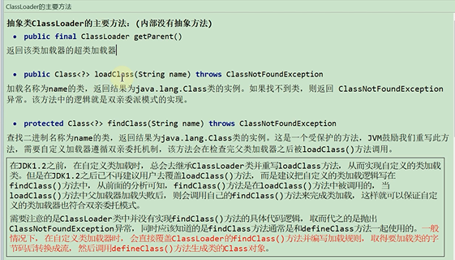
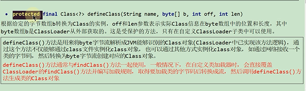
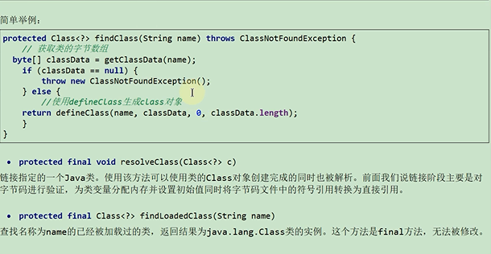
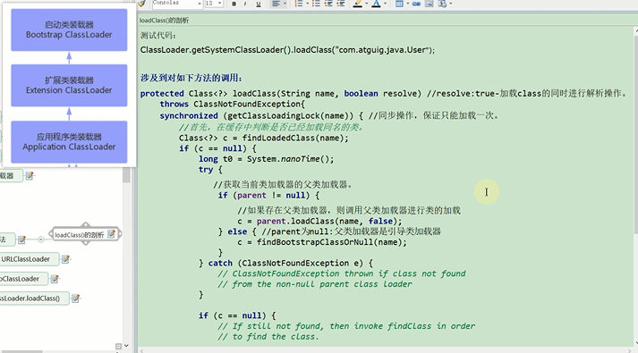
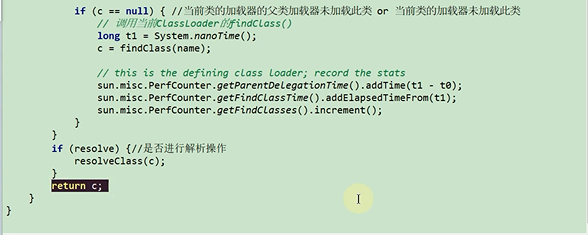
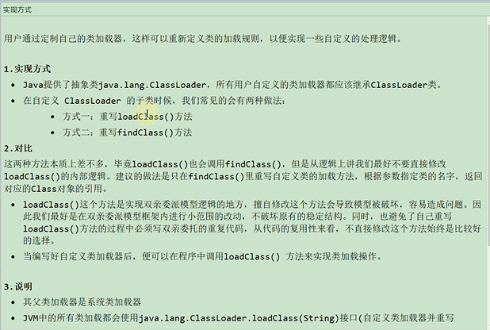
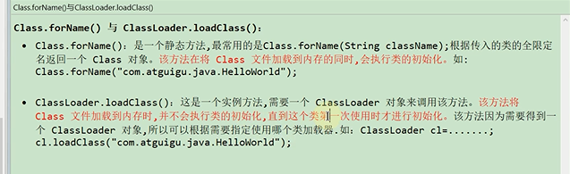

类加载过程

    加载 将.class文件加载到内存中
    
    验证 确保类文件符合JVM规范 以cafe开头
    
    准备 正式为类变量（static）分配内存 设置类变量`默认初始值` 比如int 初始值为0
    
    解析 将常量池内的符号引用转为直接引用的过程
    
    初始化 执行类构造器（clinit）`覆盖默认初始化值` 显式初始化

getParent()方法
---

获取父类加载器

loadClass()方法
---

包路径全类名加载类，返回结果为Class类的实例

该方法就是实现了双亲委派机制 

findClass()方法
---

在loadClass()方法内部操作

是真正实现加载类的方法

如果需要自定义类加载逻辑 就可以重写findClass()方法

defineClass()方法
---

根据指定的字节数组b转换为Class的实例 需要在自定义ClassLoader子类中使用

ExtClassLoader并没有重写loadClass()方法 而AppClassLoader重载了LoadClass()方法

但是最终还是调用了父类的loadClass()方法 所以这两个类加载器依然遵循了双亲委派机制

Class.forName()与Class.loadClass()区别
---

