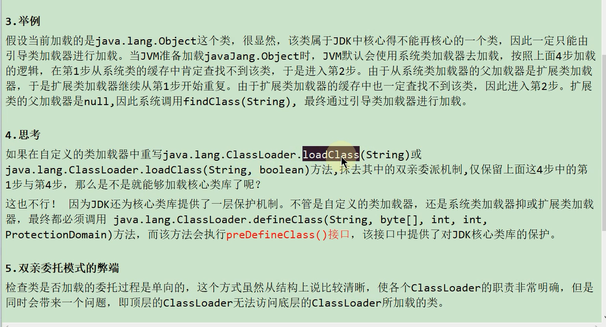
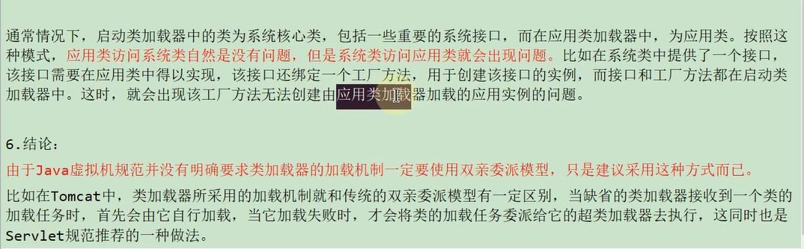

 

 

避免类的重复加载 确保一个类的全局唯一性

保护程序安全 防止核心API被随意篡改

弊端

    由于类加载的委托是单向的 ，但是顶层类加载器无法访问下层的类

在tomcat中 类加载器采用的加载机制和传统的双亲委派机制不一样

当缺省的类加载器加载类是 首先由它自己去加载 当它加载失败 才会将类加载的任务委派给它的超类加载器去执行

Tomcat 实际上只有 WebAppClassLoader 加载器中打破了双亲委派，其他类加载器还是遵循双亲委派的。 

这样做最主要原因是保证同个 Web 容器中的不同 Web 应用程序所使用的类库相互独立，避免相互影响

WebAppClassLoader 加载类的时候，故意打破了JVM 双亲委派机制，绕开了 AppClassLoader，

直接先使用 ExtClassLoader 来加载类。

最主要原因是保证部署在同一个 Web 容器上的不同 Web 应用程序所使用的类库可以实现相互隔离，避免不同项目的相互影响。

 

