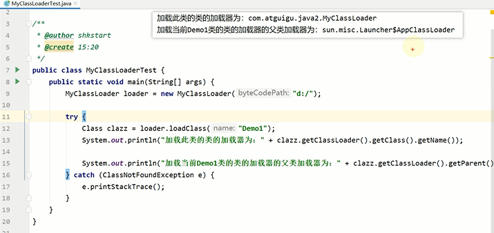
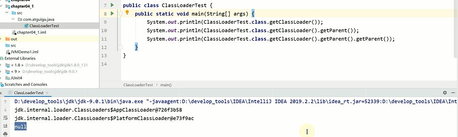
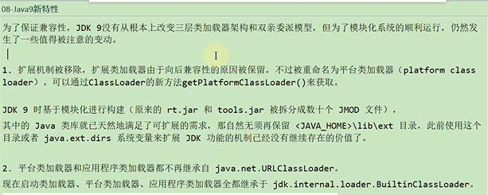
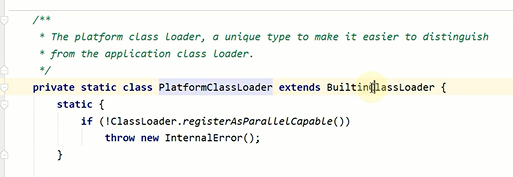
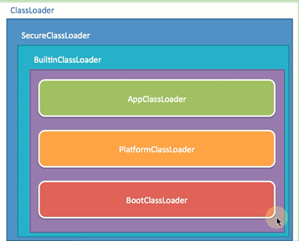
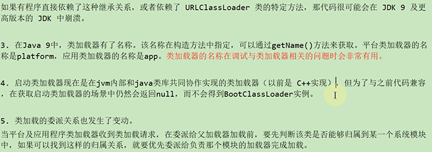
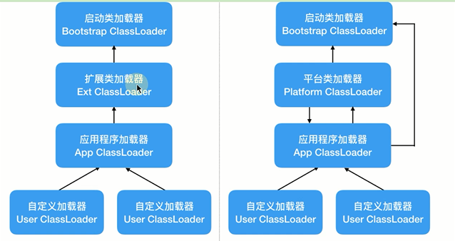
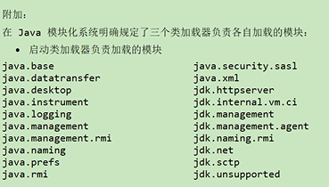
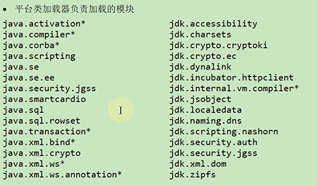

Java8中系统类加载器或者扩展类加载器都是在launcher中定义的

扩展类加载器使用的是extClassLoader

Java8中系统类加载器或者扩展类加载器都是在launcher中定义的

扩展类加载器变为了平台类加载器PlatformClassLoader 在ClassLoaders包中

Java9新特性
---

在Java模块化系统明确规定了三个类加载器负责各自加载的模块
 

