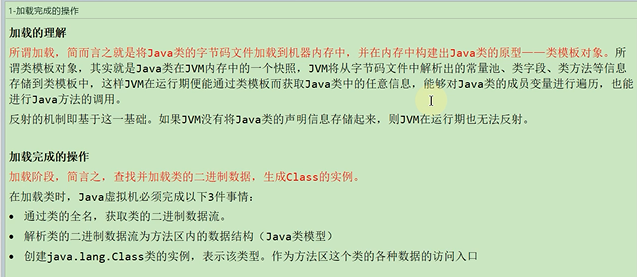

类的生命周期

    加载 通过全类名将二进制class文件读取到内存中
    
    验证 文件合法性 如文件头的cafe babe
    
    准备 静态变量 常量 设置默认值
    
    解析 符号引用改为直接引用
    
    初始化 静态变量 常量 设置初始值
    
    使用
    
    卸载 

其中 `验证 准备 解析` 这三个阶段统称为链接阶段linking

当链接阶段结束后 类信息就会放到方法区（java类模型）

二进制文件
---

加载完成的操作  
---

二进制流的获取方式
---

类模型的位置
---

加载的类在JVM会创建相应的类结构

类结构会存储在方法区

类的实例是存储在堆中 类实例中的klass pointer指向地址的就是方法区的类结构信息

而反射也是通过方法区的类结构来创建类的实例

数组类的加载
---

数组类本身不是类加载器负责创建

数组中的元素是靠类加载器创建

 

