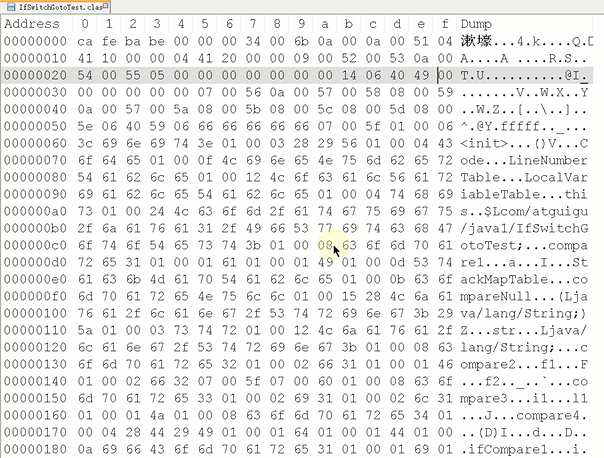
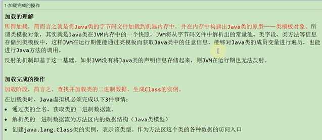

类的生命周期

    加载 通过全类名将二进制class文件读取到内存中
    
    验证 文件合法性 如文件头的cafe babe
    
    准备 静态变量 常量 设置默认值
    
    解析 符号引用改为直接引用
    
    初始化 静态变量 常量 设置初始值
    
    使用
    
    卸载 

其中 `验证 准备 解析` 这三个阶段统称为链接阶段linking

当链接阶段结束后 类信息就会放到方法区（java类模型）

二进制文件
---

加载完成的操作  
---

