验证阶段
---

保证加载的字节码是合法并符合JVM规范（如 cafebabe魔数）

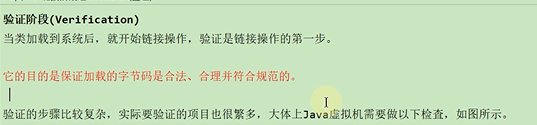

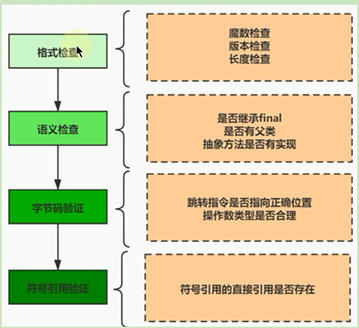

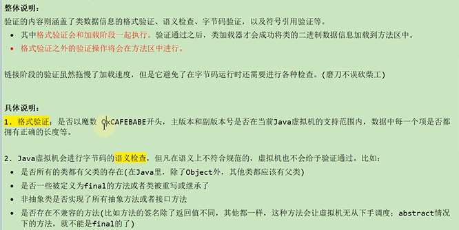

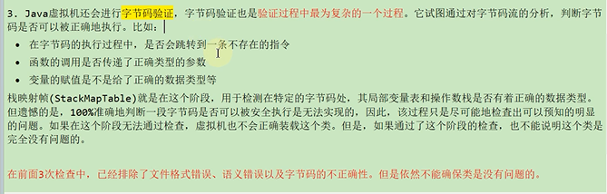

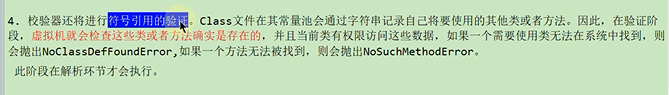

准备阶段
---

静态变量分配内存 初始化默认值

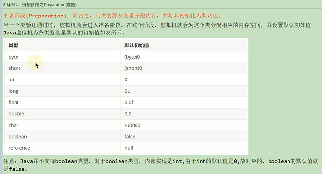

基本数据类型

    非final修饰的变量，在准备环境进行默认初始化赋值

    final修饰后 在准备环境直接进行显式赋值

如果使用字面量的方式定义一个字符串常量，也是在解析环节进行显式赋值

如果通过new String()方式定义一个字符串常量，是在初始化阶段进行显式赋值

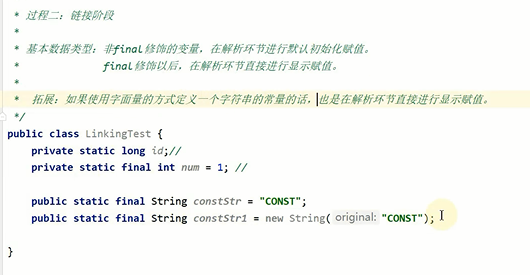

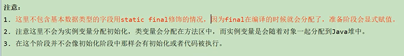

解析阶段
---

将类，接口，字段，方法的符号引用转化为直接引用（编译后的class文件中的常量池保存的就是符号引用）

直接引用就是得到类，接口，方法在内存中的指针或者偏移量

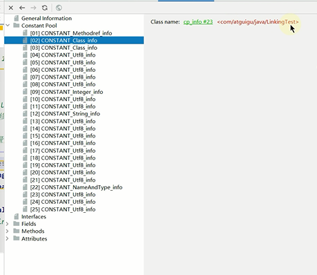

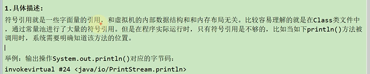

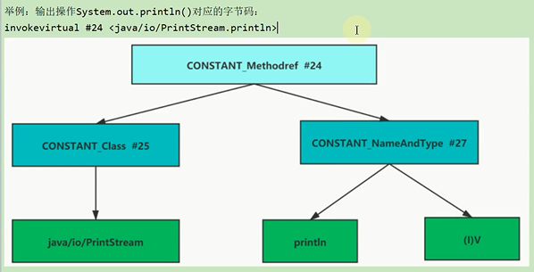

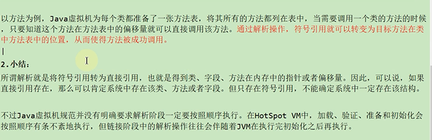

字符串常量池（String.intern） （in te n 拘留，实习，助理）
---
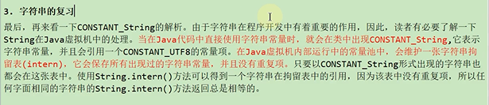

