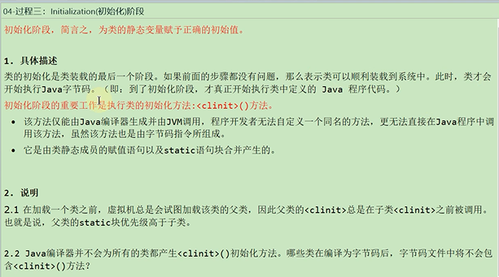
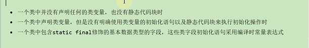
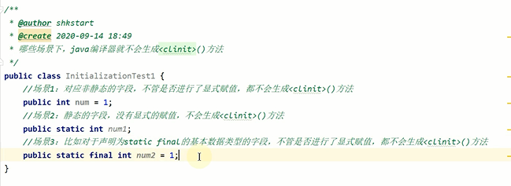
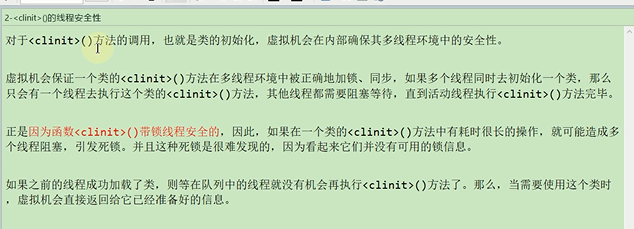
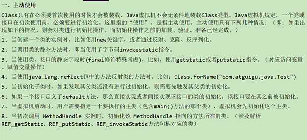
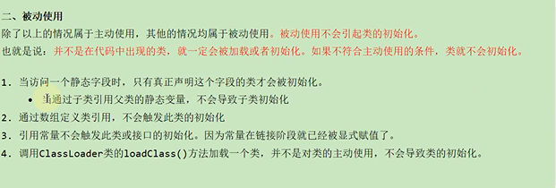

为类的静态变量赋予正确的初始值

静态方法就是在初始化阶段执行

初始化的重要工作就是执行类的初始化方法 (clinit)<>方法（clinit不同于对象构造器的init方法）

(clinit)<>方法内部由静态成员的赋值语句以及static语句块合并产生

哪些场景下 Java编译器不会生成clinit方法？
---

使用static + final修饰 且显式赋值中不涉及方法调用的基本数据类型或String类型的显式赋值

是在链接阶段的准备阶段赋值

如果涉及到方法的调用都是在初始化阶段clinit方法中实现

clinit方法的线程安全性
---

clinit方法是隐式锁

如果有多个线程同时去初始化一个类 那么只有一个线程去执行这个类的clinit方法

其他线程都需要阻塞等待

主动调用和被动调用
---

主动调用会进行类的初始化 如new Object() 或者 Class.forName()方法

被动调用如ClassLoader.loadClass()方法 不会进行类的初始化

