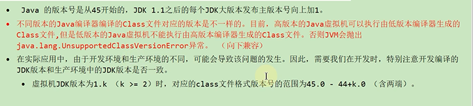
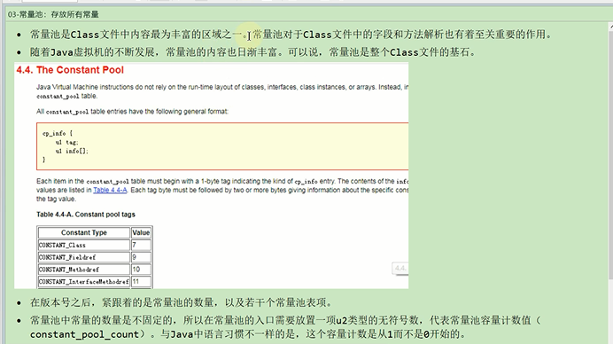

前端编译器
---

使用javac demo.java命令

前端编译器不属于JVM部分

字节码指令
---

class文件是一组以8个字节为基础单位的二进制流

.java文件经过前端编译器编译后生成.class二进制的字节码文件

类文件中的操作数栈 就有操作码和操作数

程序计数器存放下一条指令地址。

根据计数器中的指令地址

执行引擎来读取指令代码。

执行引擎操作栈的局部变量表，操作数栈。

把字节码指令翻译成机器指令。

最后CPU执行机器指令。

Class文件的总体结构
---

    魔数
    
    class文件版本
    
    常量池
    
    访问标识
    
    类索引 父类索引 接口索引结合
    
    字段表集合
    
    方法表集合
    
    属性表集合

魔数
---

版本号
---

常量池
---

 

字面量和符号引用
---

 