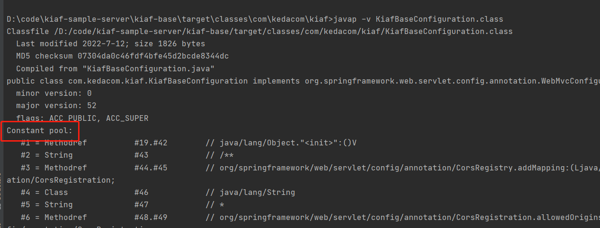
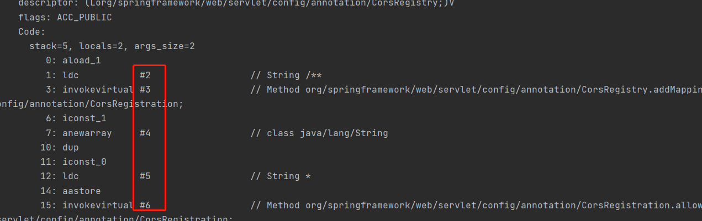
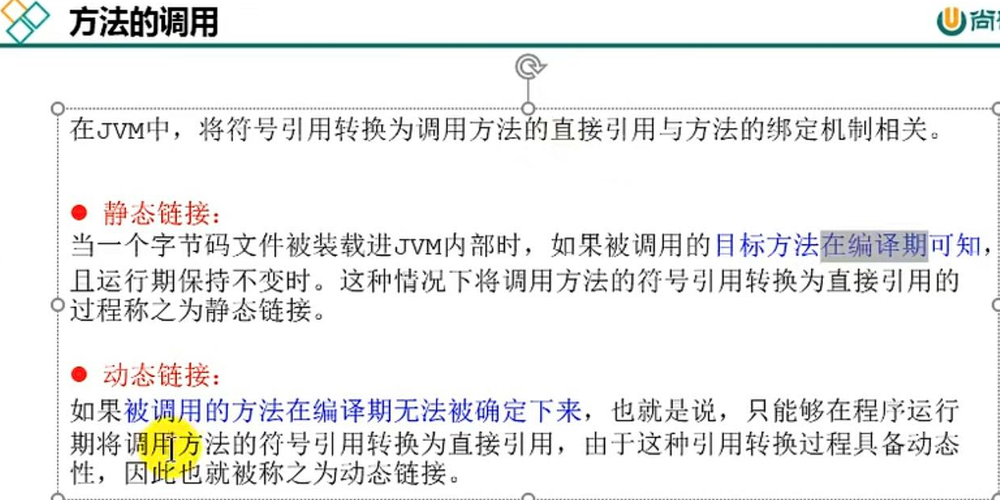
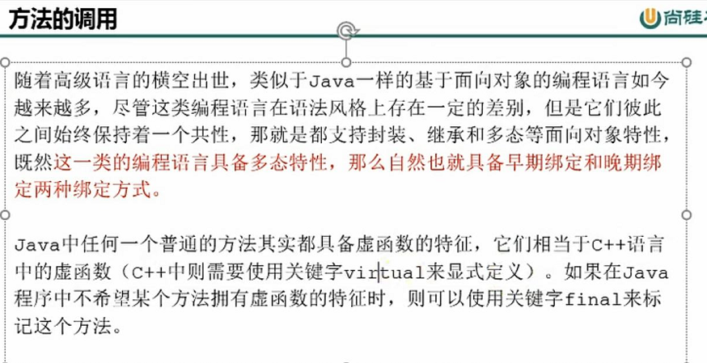
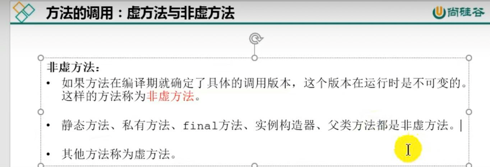
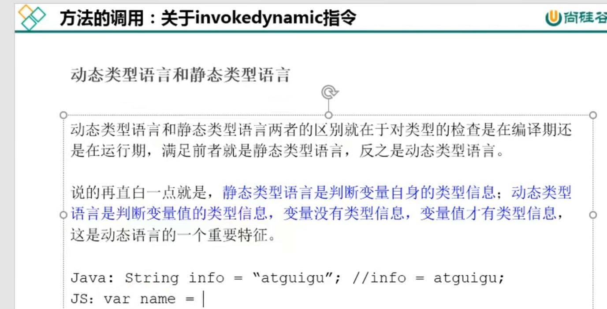
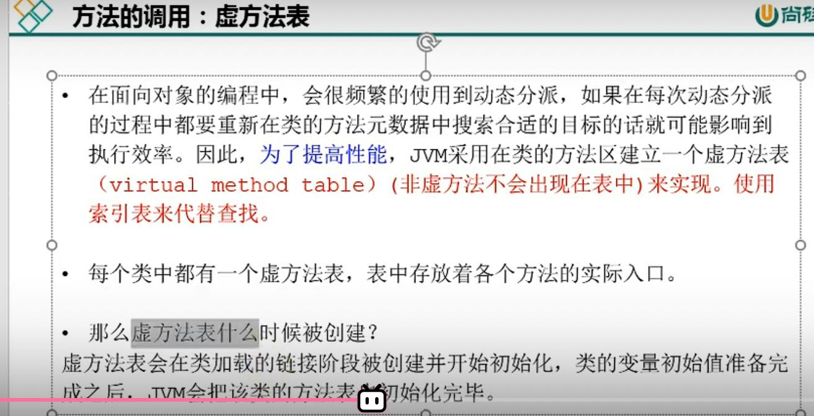

动态链接

指向运行时常量池的方法引用

字节码文件中的constant pool就是常量池

code中的井号加数字 就是找到constant pool中的方法(符号引用转化为调用方法的直接引用)(pool里面都是类方法 ，放在运行时常量池)

运行时常量池在堆里面，逻辑上是属于方法区的（JDK 1.8是这样的）

常量池的作用 就是提供符号和常量，便于指令的识别。

方法的调用,方法的绑定分两种：

符号引用转化为调用方法的直接引用的绑定机制有关系

早期绑定-静态链接
晚期绑定-动态链接

virual（虚拟）

