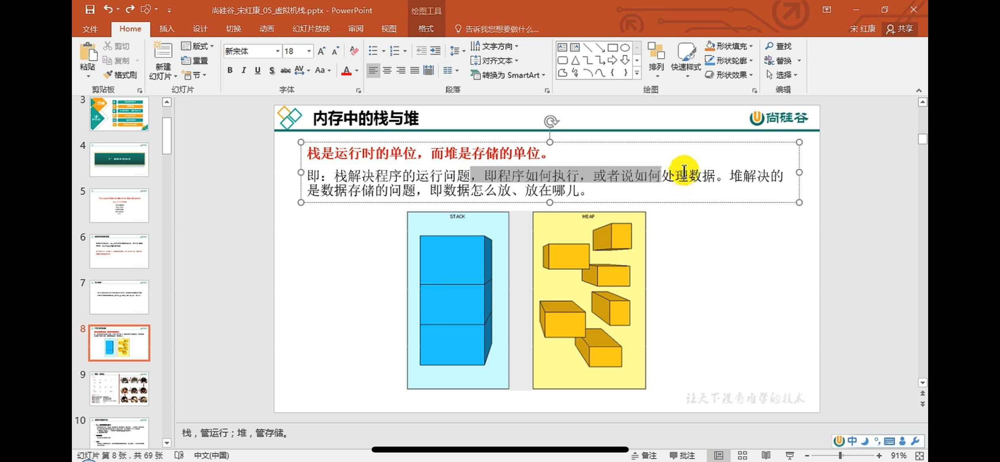
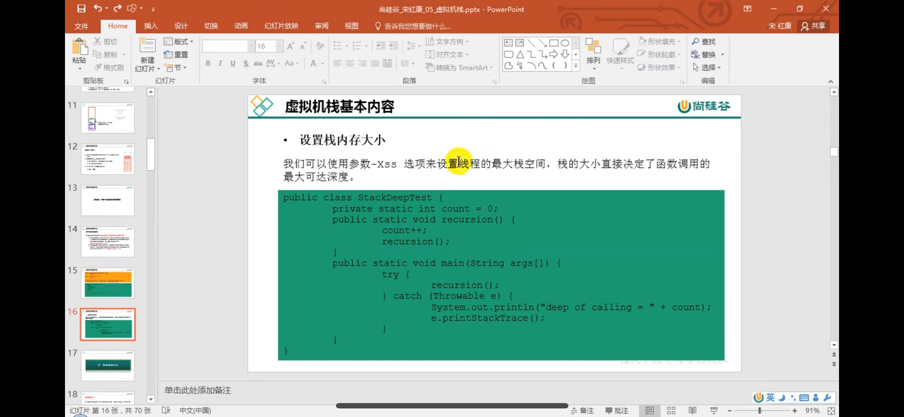

栈是运行时的单位，堆是存储的单位

结构为FIFO 先进先出

栈中的局部变量为 基本数据类型 引用类型放的是对象的引用地址。

栈帧中存储了方法的局部变量表、操作数栈、动态连接、方法返回地址

和附加信息（例如，调试、性能收集相关的信息，取决于具体的虚拟机实现，是《Java虚拟机规范》中未描述的信息）。

栈存在OOM,不存在GC 只有进栈出栈的操作

固定大小的虚拟机栈 超过最大容量 抛出 stackOverFlowError

虚拟机栈可以动态扩展大小，无法创建新的虚拟机栈 会抛出outOfMemoryError

Linux默认是1024KB,window根据虚拟机内存决定，无默认值

    动态栈一般有两种方法：Segmented stack和Stack copying：
    
    Segmented stack
    
    它可以这么理解，当一个双向链表把多个栈连接起来，它一开始只分配一个栈，当这个栈的空间不够时，就再分配一个，用链表一个一个连起来。
    
    Stack copying
    
    作用为在栈不够时，分配一个更大的栈，再把原来的栈复制过去。

