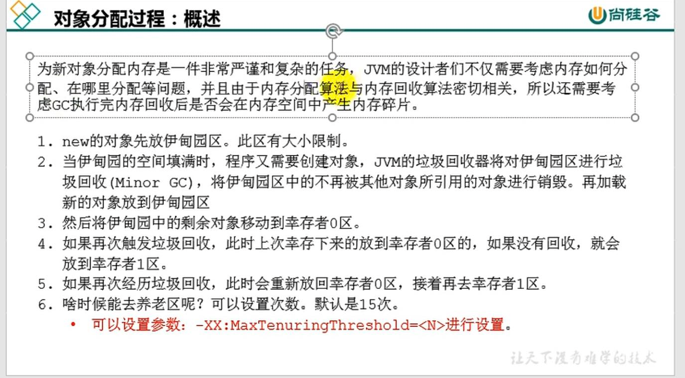

```
方法区（Java8 元空间） 和 堆 对于进程（一个JVM实例 一个runtime）来说是唯一的
```
```
堆是在jvm启动时候被创建，其空间大小也被确定了。
```
```
堆在物理上可以不连续，但是逻辑上是连续的。
```
```
所有线程共享堆，但对象在分配内存可以划分到 

本地线程分配缓冲 TLAB（ thread local allocation buffer）
```
```
几乎所有的对象实例（包括数组）都分配在堆。
```


-Xms 初始内存（默认是物理内存1/64） -Xmx 最大内存(（默认是物理内存1/4）) 设置年轻代+老年代内存

元空间/永久代 属于堆外内存(直接内存) 属于操作系统内存

```
开发中建议初始和最大内存 设置为相同的的值。
因为反复的扩容和释放给系统造成不必要的压力
```

jps 查看 Java pid
jstat -gc pid 查看GC回收信息

默认young占1/3的堆内存 old占2/3的堆内存

在hotspot中 Eden和两个survivor空间占比是8：1：1



```
Eden区满的时候触发YGC/minorGC
survivor满的时候不触发YGC/minorGC
YGC/minorGC触发的时候会将Eden和survivor一起回收
survivor是被动跟随Eden触发回收
```

总结:频繁回收young 较少回收old 几乎不在meta space回收 
