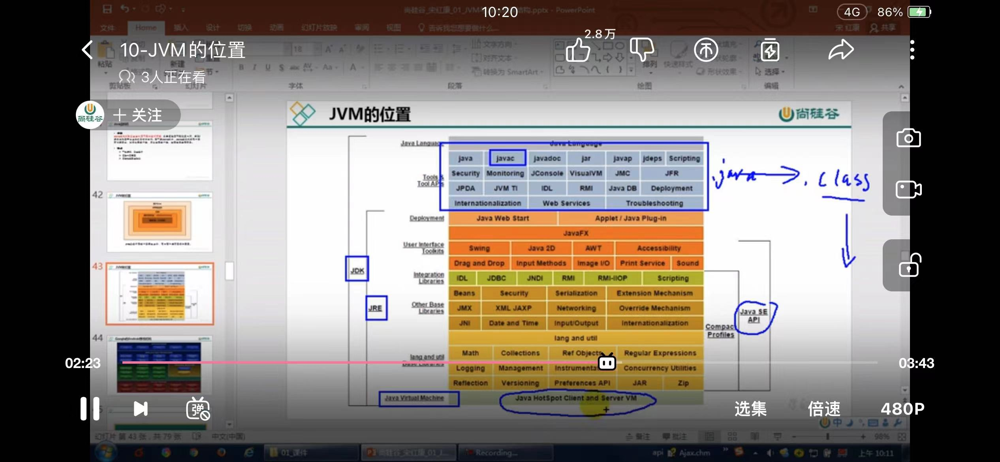
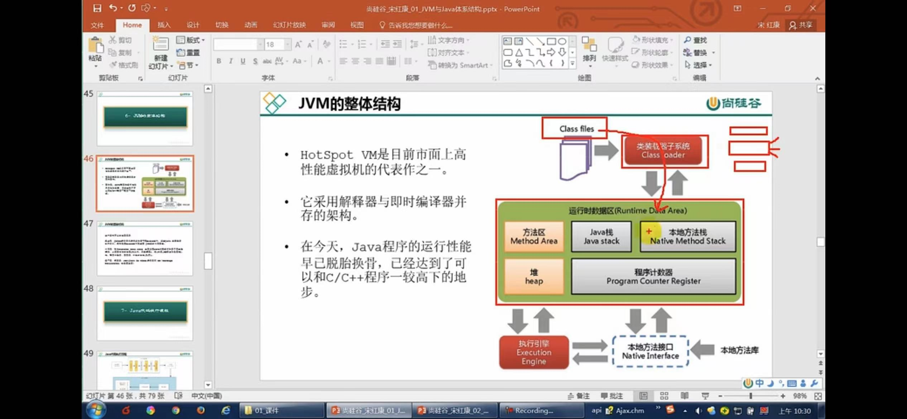
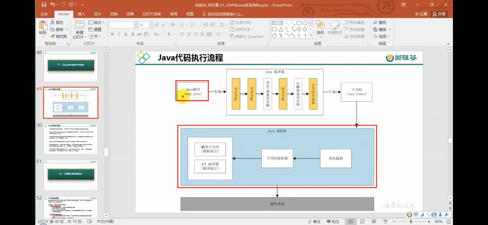
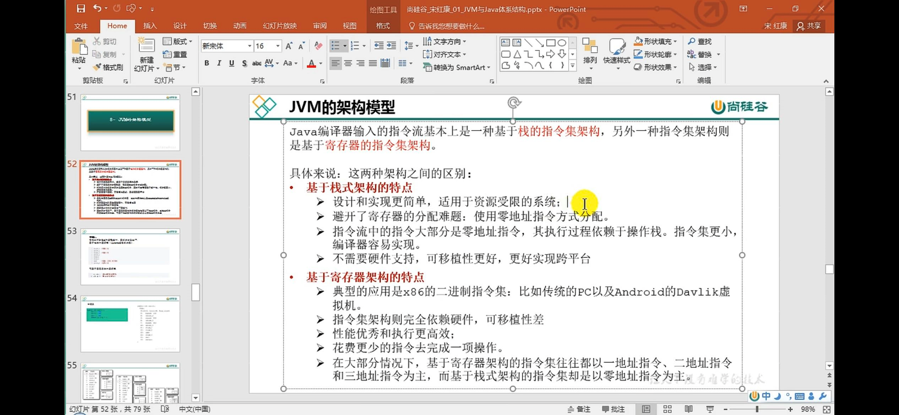

JDK - JRE -JVM

前端编译器 javac编译器 .java 转成.class
前端javac编译器是转成字节码 后端jit编译器转成机器指令

类加载器-》运行时数据区 《-》 本地方法接口 JNI <-本地方法库

-》执行引擎

执行引擎：

解释器（interpreter） 
JIT编译器 （JIT compiler）
垃圾回收器（GC）

二次编译 源文件编译成字节码文件，再通过JIT转成机器指令，对于热点 频繁调用的指令，JIT会缓存起来

