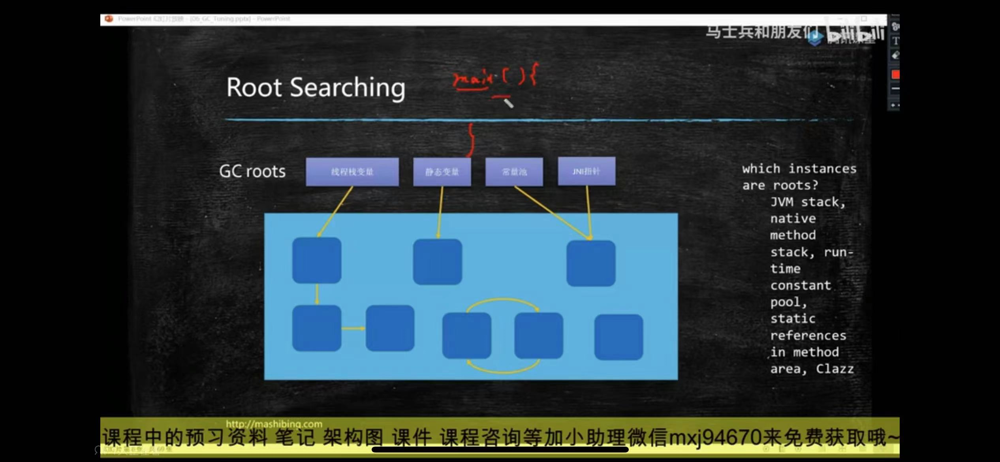

如何确定一个对象是垃圾

reference count
引用计数 有没有引用指向对象
但是无法解决循环引用

root searching
根可达性算法

虚拟机栈中的引用对象
方法区中类静态属性引用的对象
方法区中常量引用对象
本地方法栈中JNI引用对象

垃圾回收算法

mark-sweep 标记清除
将内存分格子存储数据 内存碎片多

复制算法
copying
浪费内存

mark-compact 标记压缩
将内存分格子存储数据 回收垃圾后 会将格子合并

Parallel Scavenge + Parallel Old (1.8默认)

PS/PO 分代 

G1  物理分区 逻辑分代

内存分配比例

    young 1/3 old 3/2
    eden survivor1 survivor2 8:1:1

survivor 年龄到了进入old  -XX:maxTenuringThreshold 一般是15 CMS默认是6

