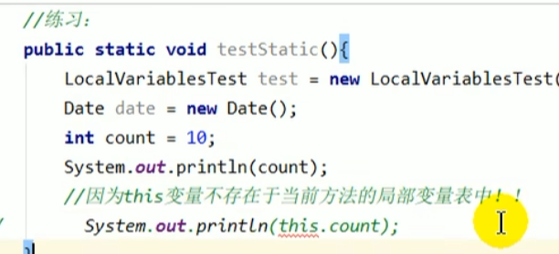
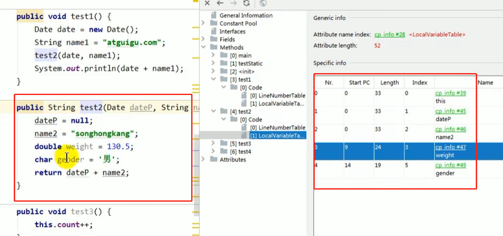
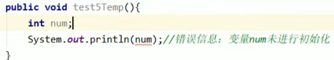

存储方法参数和方法体内的局部变量

基本数据类型【整数类（byte（1字节）、short（2字节）、int（4字节）、long（8字节））、浮点类（float（4字节）、double(8字节)）、字符类（char）（2字节）、布尔型（boolean）（1字节）】 
对象引用 以及return address类型

线程私用 不存在数据安全问题

仅在单线程内访问数据。由于不存在共享，所以即使不设置同步，也不会出现并发问题！

如果局部变量的引用超出了作用域 要考虑线程安全

局部变量表 容量大小是在编译器确定下来的 运行期不会改变大小

栈越大 方法嵌套调用的次数越多 参数和局部变量越大 嵌套调用的次数越少

局部变量表随着栈帧的销毁而销毁

局部变量表里 存储单元 叫 slot （变量槽）

    32位(4字节)以内的占一个slot

    64位（8字节 long double 占两个slot）

    btye short char 转出int boolean也是转成int 0 or 1

    局部变量和入参 会按照顺序复制到局部变量表中的每一个slot中

    构造方法和实例方法创建的话 那该对象引用this将会放在index为0的slot上

    其余的按照参数的顺序继续排列

栈帧中局部变量表的slot可以重复使用 如果局部变量过了作用域 申请新的局部变量可替换掉之前的槽位

成员变量 在使用前都经历过默认初始化赋值:

    类变量 在linking(链接)的prepare（准备）阶段 给类变量赋默认值 initial（初始化）阶段 显示赋值 即静态代码块赋值

    实例变量 随着对象创建，在对空间分配实例变量空间 ，并进行默认赋值

局部变量 在使用前 必须要进行显示赋值 否则 编译不通过

局部变量表的变量也是垃圾回收根节点 表中直接引用和间接引用都不会被垃圾回收

在栈帧中 局部变量表占比也是最大的