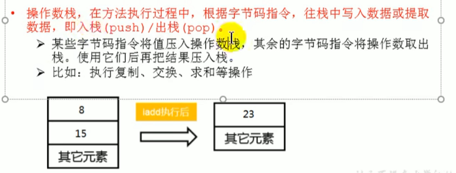
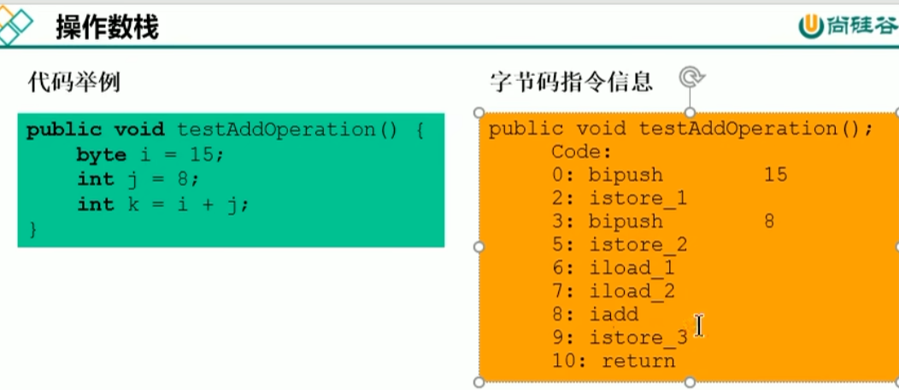
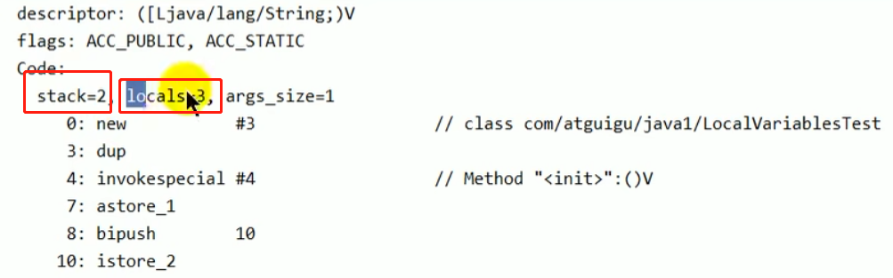
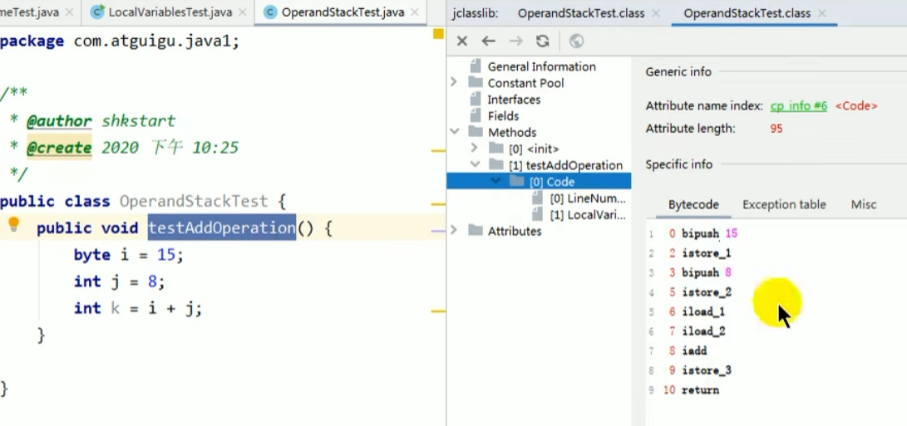
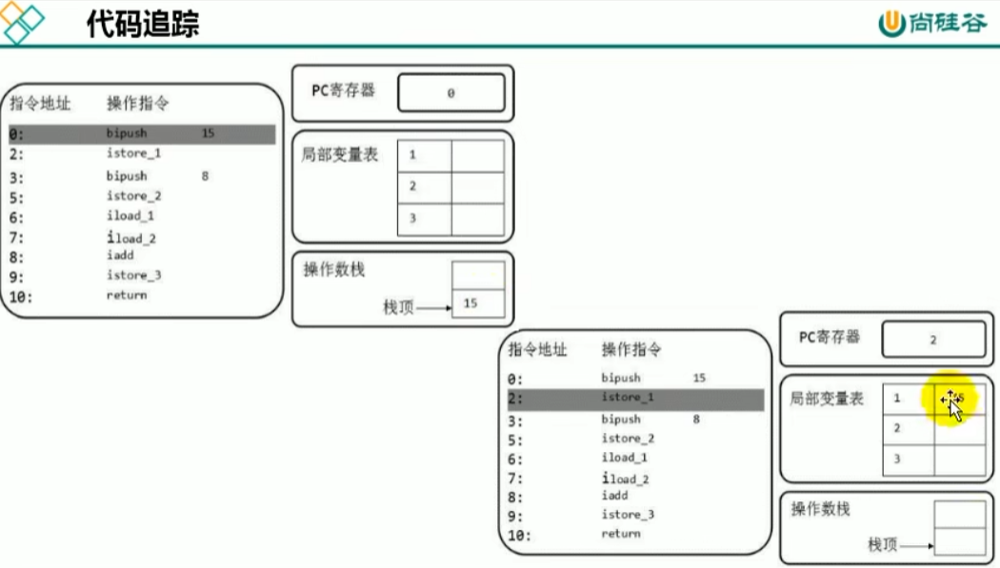
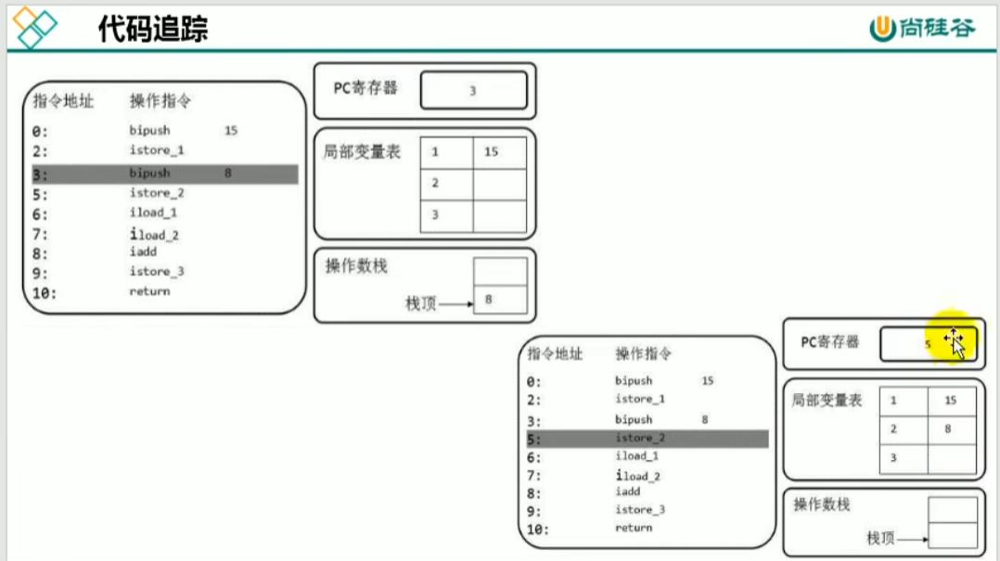
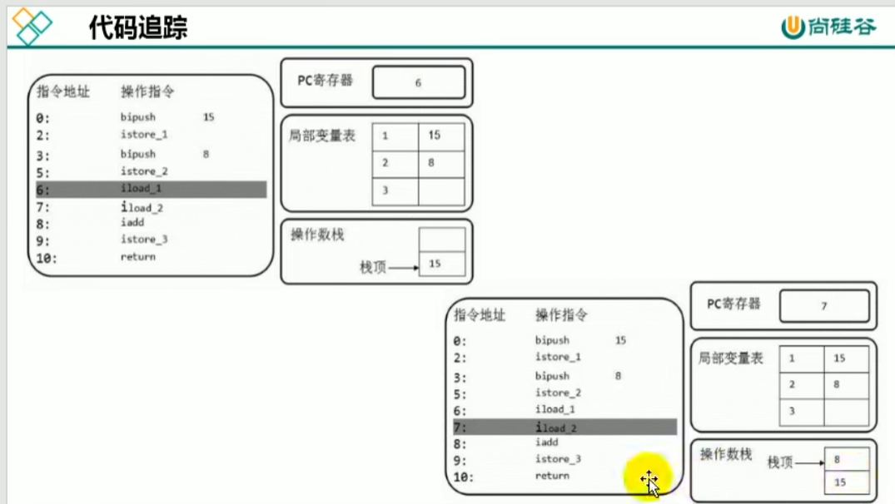
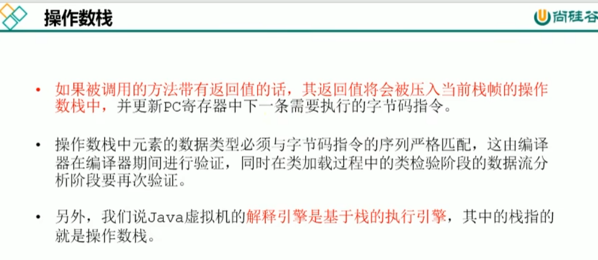

栈可以用数组或者链表来实现

也是先进后出 后进先出

入栈(push) 出栈（pop）

字节码指令将值压入操作数栈 其余的字节码指令将操作数取出 使用后把结果压入栈

方法执行入栈 栈帧被创建时 操作数栈是空的
作为一个数组 操作数栈有明确的深度 就是数组长度 在编译器就定义好了
在方法的code属性 叫max_stack

stack就是操作数栈深度 locals是局部变量表的深度

    32bit（位）(4字节)以内的占1个栈单位深度

    64bit（位）（8字节 long double 占两个slot）以内的占2个栈单位深度

操作树栈 不是用数组下表索引的方式进行数据访问 只能是入栈 出栈

对数据的操作 PC寄存器（程序计数器） 先找到指令地址 

操作数栈数据入栈 这时候局部变量表是空的

执行操作指令 取出来后放入局部变量表中

