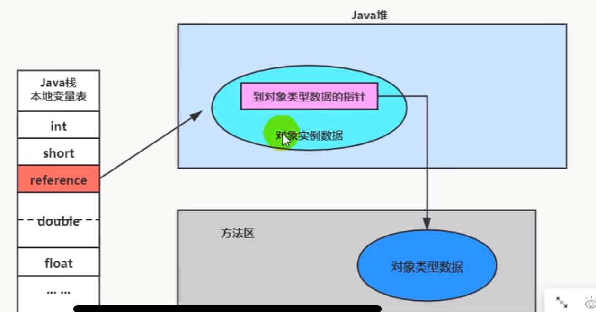

对象的创建步骤：
---

对象的内存布局：
---

对象头 header

    1.mark word 8字节 64位
        
        原始的hashCode
        锁信息
        GC信息
        偏向锁的话会有线程ID

    2.klass point 指向方法区中对象的类型 Object.getClass();  4字节

    如果是数组的话， 对象头里会记录数组的长度

实例数据 instanceData

    对象存储的信息，包括父类的字段

对其填充 padding

    因为Java对象长度要求是8byte的倍数，如果不足会header和instanceData长度不足会补足

对象访问定位：
---

    reference  -> heap(对象存在堆里，而对象头内有klass point) -> 方法区（meta space 元空间）中的类型信息

对象访问定位的两种方式：
---

1 直接指针（hotspot采用）

2 句柄访问
    在栈中的对象引用reference 指向了 heap中存放的句柄池 句柄池中有对象实例的指针和对象类型的指针，分别指向对象的实例地址，和方法区中的对象类型地址

直接指针 直接指向了 heap中的对象实例，定位块， 而句柄需要reference先指向句柄池。

句柄访问 在对象实例地址发生变化的时候，栈中的reference指向句柄池的指针是不用变的

只要句柄池重新指向实例池，对于栈空间的reference是不需要改动的

