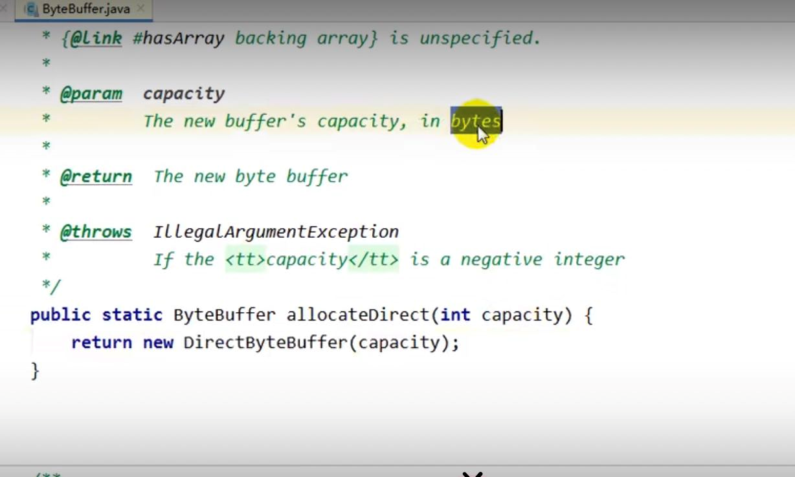
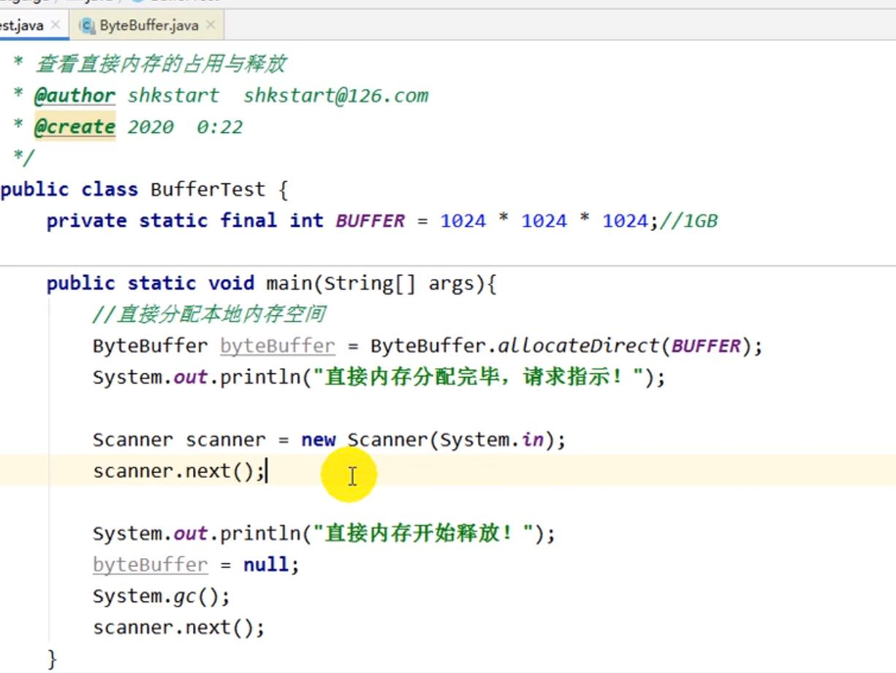

来源于NIO，通过directByteBuffer操作native内存。

NIO(非阻塞IO)
 传统IO简单说基于流stream NIO提出的buffer缓冲区 和 channel通道，当然，底层还是byte

访问直接内存的速度快于访问Java内存的速度，用户态内核态切换，从用户内存写到内核空间（这算一次IO操作）

NIO使用了MMAP，内存映射，用户空间地址和内存空间地址做了映射。省去了用户内核切换，和用户buffer和内核buffer的IO。

