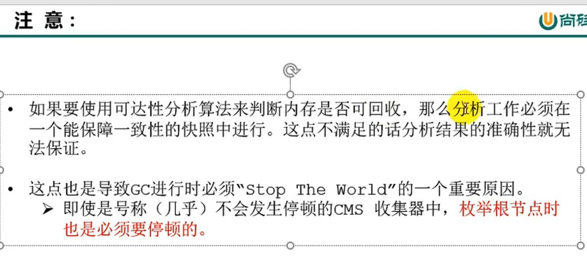
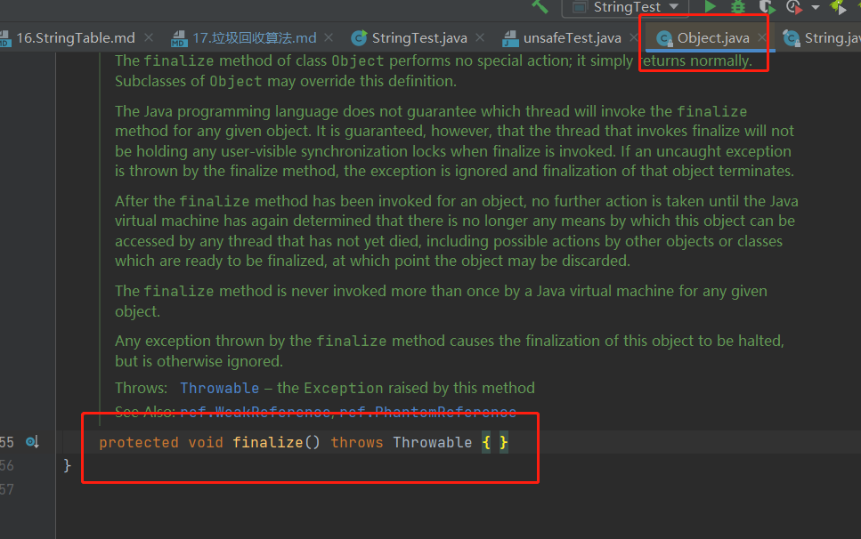
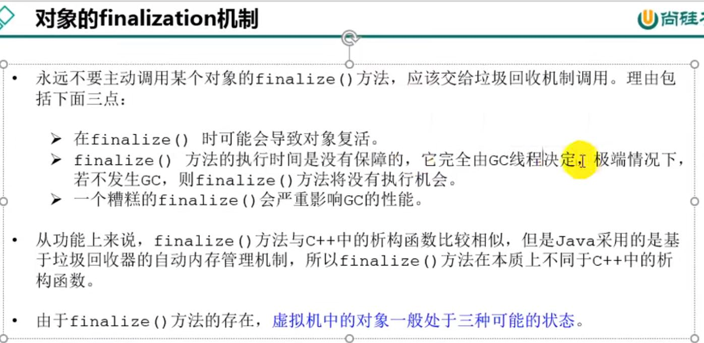
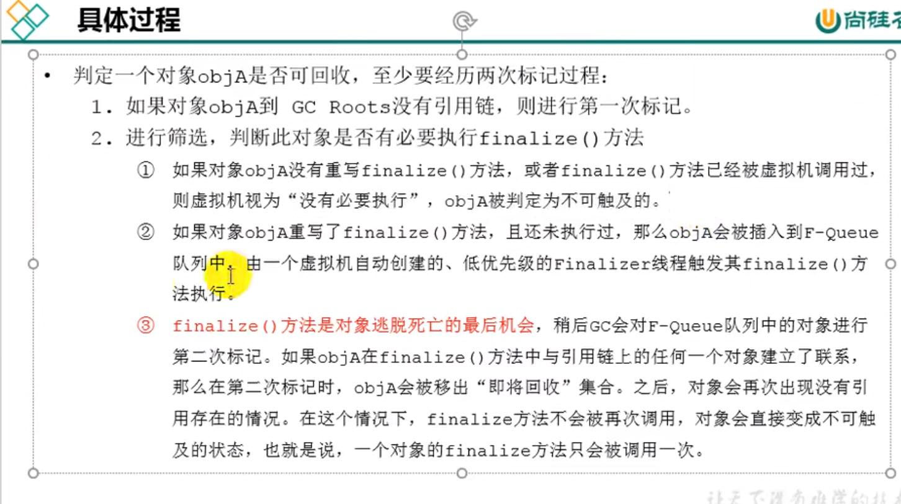

输出GC详情
---
-XX:+PrintGCDetails

标记阶段：对象是否存活
---
1 引用计数算法

python使用的引用计数算法，提前解除引用关系，使用弱引用weakRed

2 可达性分析算法

GC roots 根集合

如果在YGC时候 Eden区的对象被old区的对象所引用，要考虑old区的对象是否要加入GC roots中。

对象的finalization机制
---

Object.finalize(); 方法只能被调用一次。如果被复活，第二次垃圾回收时，如果是null直接回收。

内存分析工具
---
eclipse memory analyzer

jprofiler

清除阶段
---
标记-清除，复制，标记-压缩

