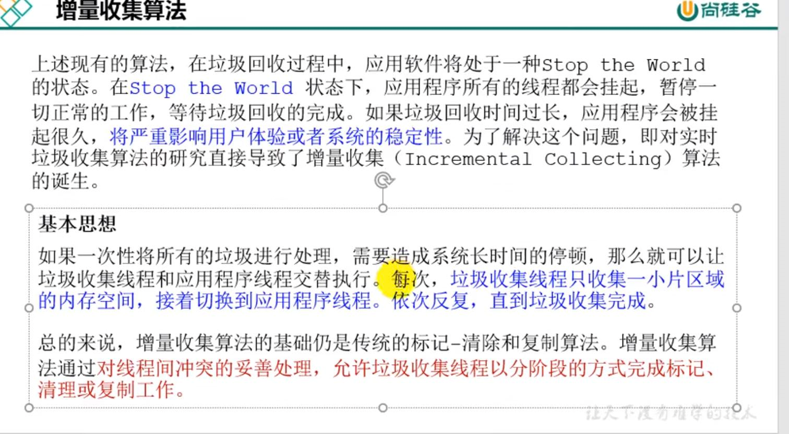
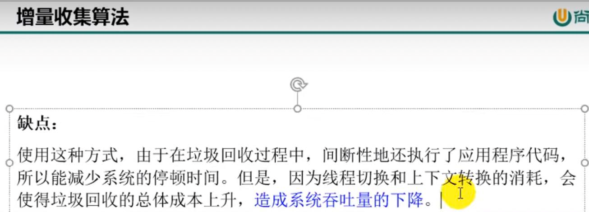
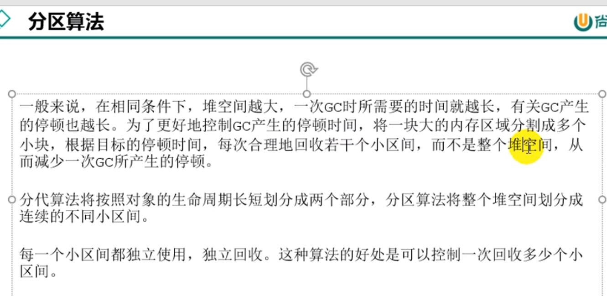

增量收集算法
---
垃圾回收过程中，stop the world的状态会导致所有线程挂起，系统长时间停顿。

用户线程和垃圾回收线程交替执行，减少停顿。

而这种增量收集算法的缺点就是线程切换，上下文转换，对CPU的占用上升，对吞吐量有影响。

分区算法
---
像G1就使用了region的概念将 堆内存中的young，old进行分区，一整个大的old区

切割成若干小区域，分开进行收集。

