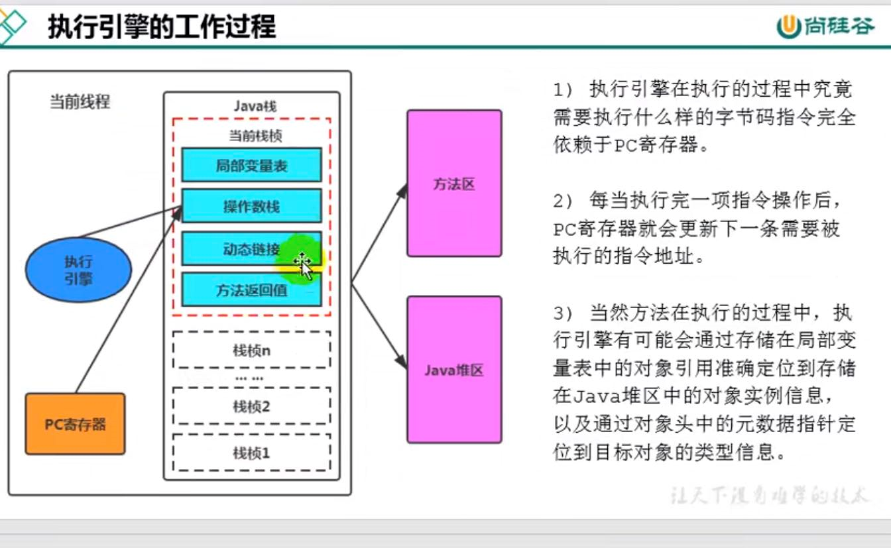

execution engine（执行引擎）
---

包含了解释器，JIT即时编译器，GC垃圾回收器。

功能是将字节码指令翻译成对应平台的本地机器指令。

执行引擎主要是执行Java栈中的指令，就是PC寄存器读的指令。就是class字节码中的code

编译和执行的过程
---

解释器是直接执行用编程语言编写的指令的程序，而编译器是把源代码转换成即翻译低级语言(机器语言)的程序

两者都是将高级语言转换成机器码，解释器在程序运行时将代码转换成机器码，编译器在程序运行之前将代码转换成机器码

JIT即时编译器能将本地热点代码做一个缓存，提高效率。

