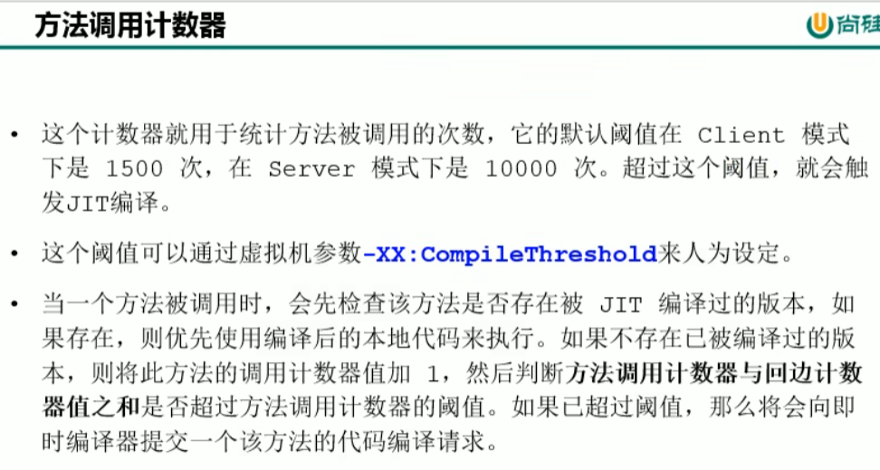
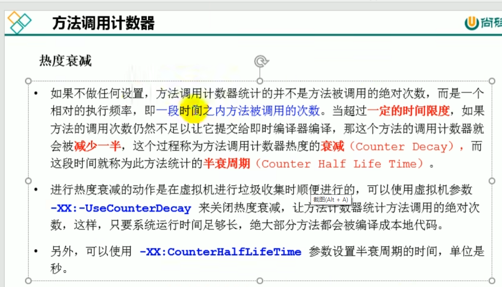
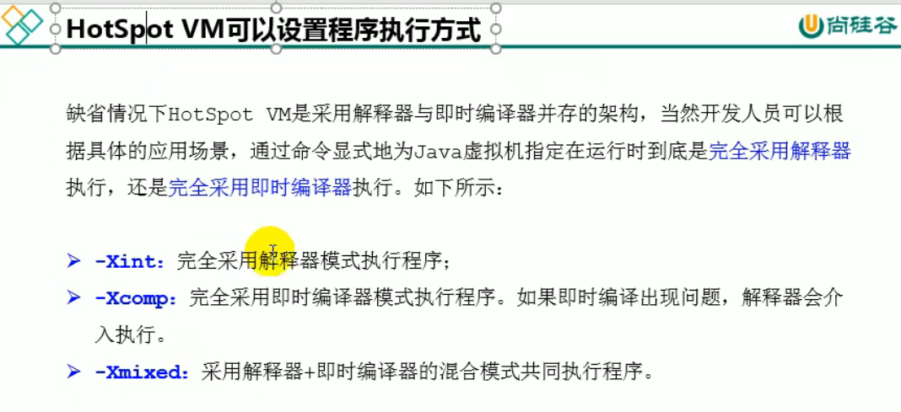
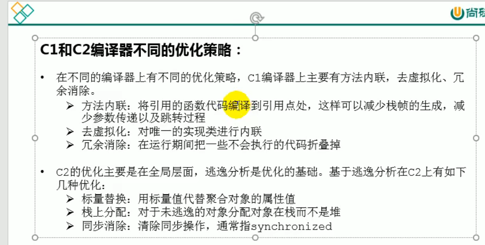

前端编译器，JIT编译器，AOT编译器
---

热点代码及探测方式

方法体调用次数和循环体内的循环次数

计数器统计热点并非是一直累加，有半衰周期，在一定时间内调用次数仍然达不到标准，这个计数器就会减去一半

Hotspot设置运行模式
---
可设置纯编译器模式和解释器模式，或者混合模式（默认混合模式）

JIT编译器 默认有两个编译器 
---

client compiler：简单的优化，耗时短

server compiler: 64位环境默认是server compiler，更激进和深入的优化，耗时长
                 C2的编译器 栈上分配，标量替换，同步清除（锁清除)

